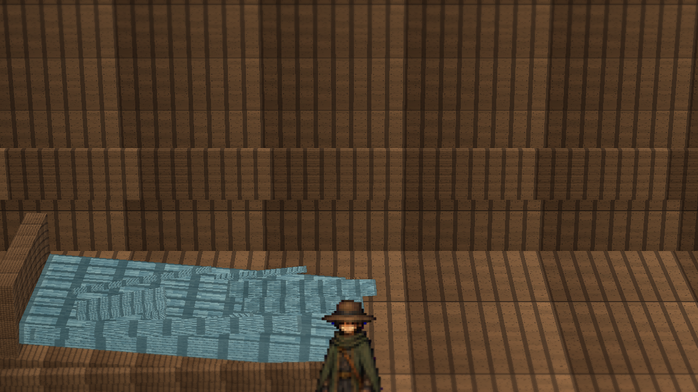
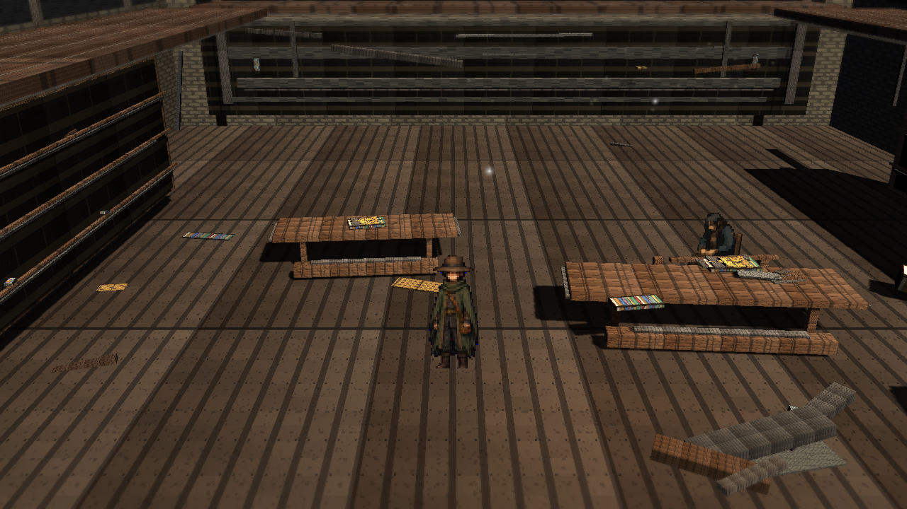
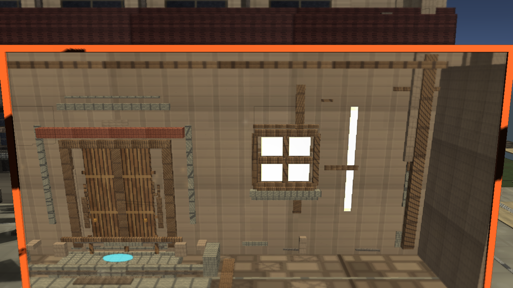

# Stage 6b Painted God Rays Refined

Branch: `work/fast-vs-hd2d-shading-foundation-20260522`

Build: `C:\Users\maro6\Documents\Unity\Anemora-fast-vs-v24-hd2d-work\Builds\FastVS_HouseSlice\Anemora_FastVS_HouseSlice.exe`

Launch the whole `Builds\FastVS_HouseSlice` folder, not the exe alone.

## Captures

## Validation

- Single validate: `Logs/stage6-painted-rays-refined-validate-single.log`, exit 0.
- Full validate: `Logs/stage6-painted-rays-refined-validate-full-gfx.log`, exit 0.
- Capture: `Logs/stage6-painted-rays-refined-capture-gfx.log`, exit 0.
- Build: `Logs/stage6-painted-rays-refined-build-gfx.log`, exit 0.
- Smoke: `Logs/stage6-painted-rays-refined-smoke.log`, killed after 20 seconds, error-pattern match count 0.
- TimeWindow aperture was visually checked and was not black.

## Gap Notes

- Refined overlay reduces some dark veil, but the result still reads as a flat screen-space overlay.
- Warm light shafts remain weak and do not match the reference's volumetric, spatially grounded atmosphere.
- The scene still lacks reference-level diorama scale, material richness, authored composition, and warm/cool light contrast.
