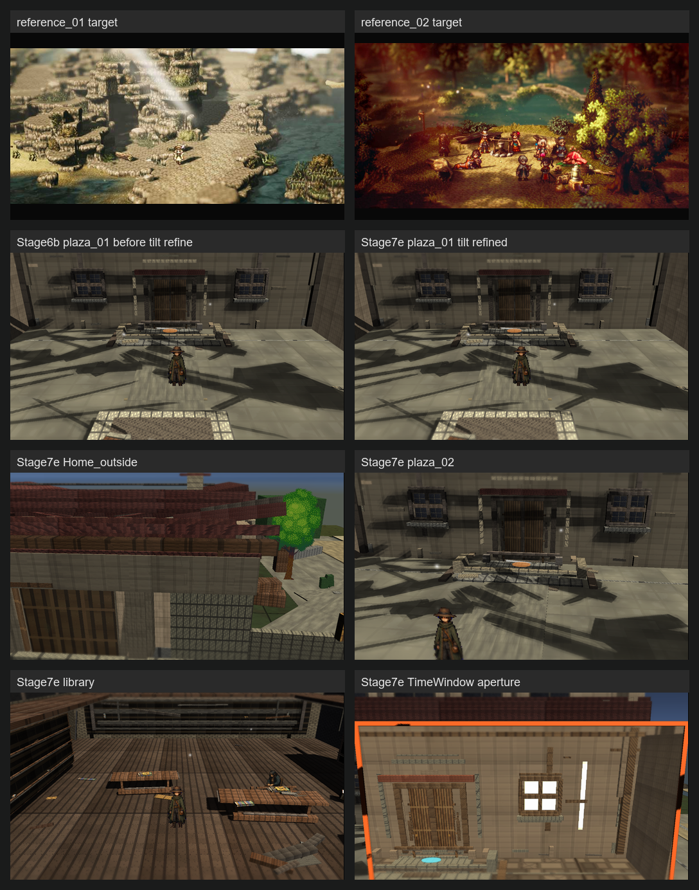
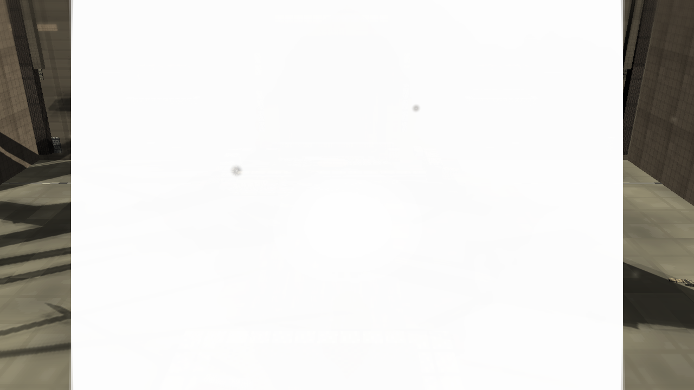
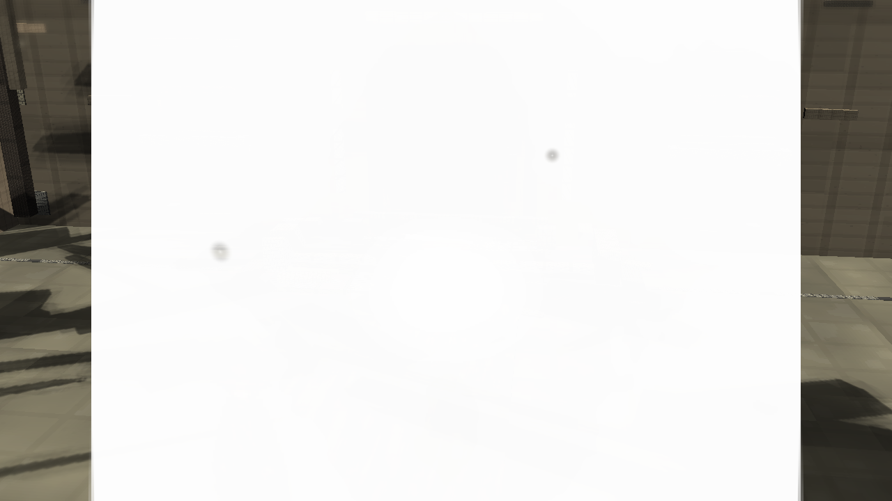
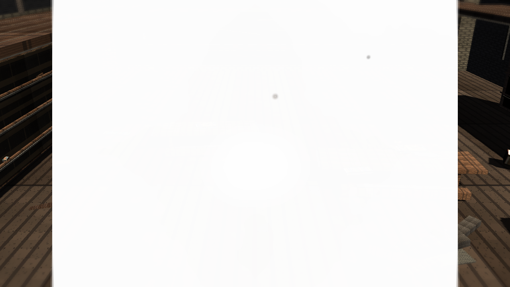
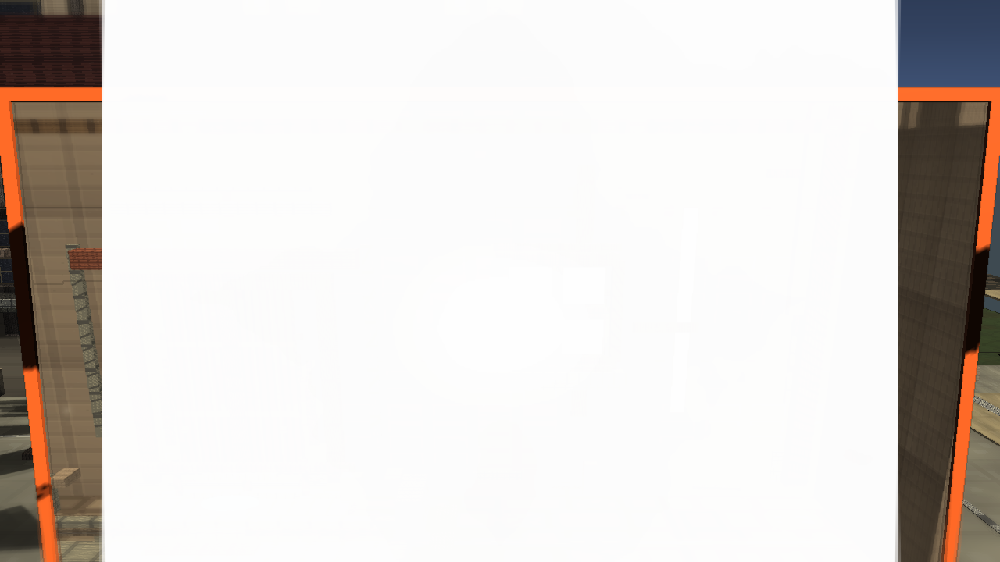

# Stage 7e Tilt-Shift Refined

Branch: `work/fast-vs-hd2d-shading-foundation-20260522`

Build: `C:\Users\maro6\Documents\Unity\Anemora-fast-vs-v24-hd2d-work\Builds\FastVS_HouseSlice\Anemora_FastVS_HouseSlice.exe`

Launch the whole `Builds\FastVS_HouseSlice` folder, not the exe alone.

## Comparison

## Captures

## Validation

- Single validate: `Logs/stage7-tiltshift-refined-validate-single.log`, exit 0.
- Full validate: `Logs/stage7-tiltshift-refined-validate-full-gfx.log`, exit 0.
- Capture: `Logs/stage7-tiltshift-refined-capture-gfx.log`, exit 0.
- Build: `Logs/stage7-tiltshift-refined-build-gfx.log`, exit 0.
- Smoke: `Logs/stage7-tiltshift-refined-smoke.log`, killed after 20 seconds, error-pattern match count 0.
- TimeWindow aperture was visually checked and was not black.

## Gap Notes

- The blur is still too modest to create reference-level miniature depth.
- Scene scale, surface richness, light hierarchy, and authored composition remain well below the target images.
- Current god rays and atmosphere are still screen-space/fallback effects, not convincing spatial light.
