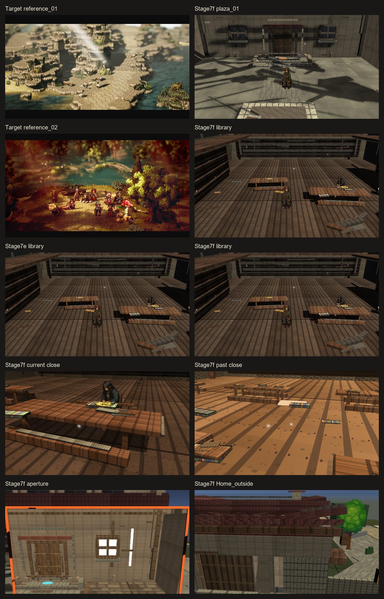
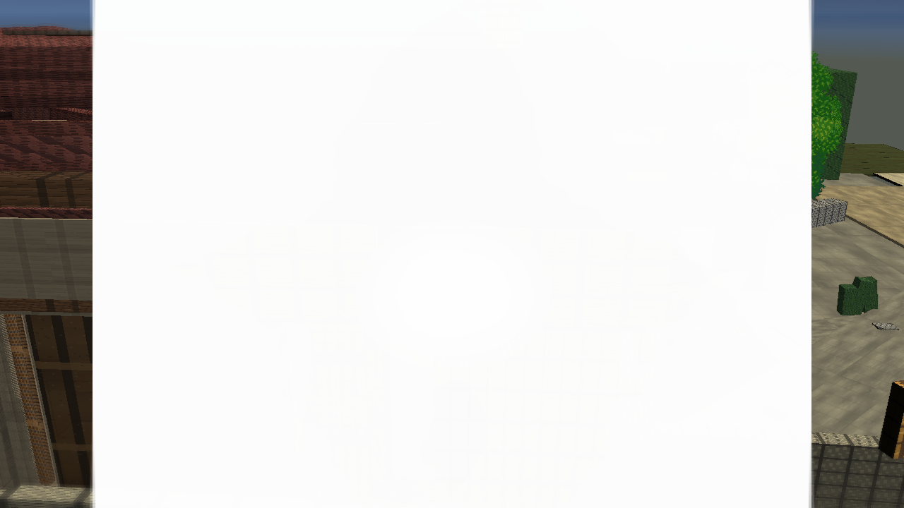
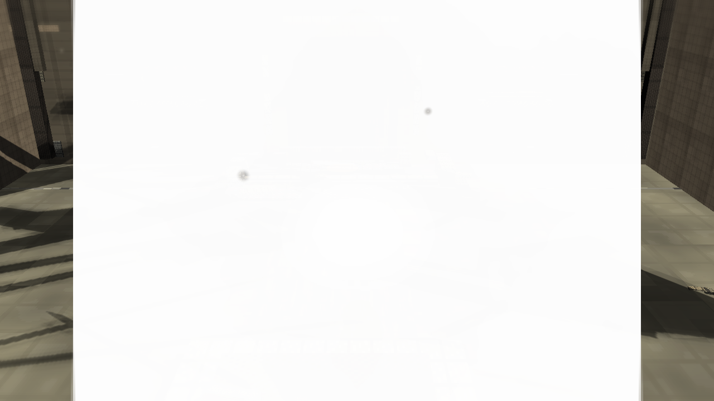
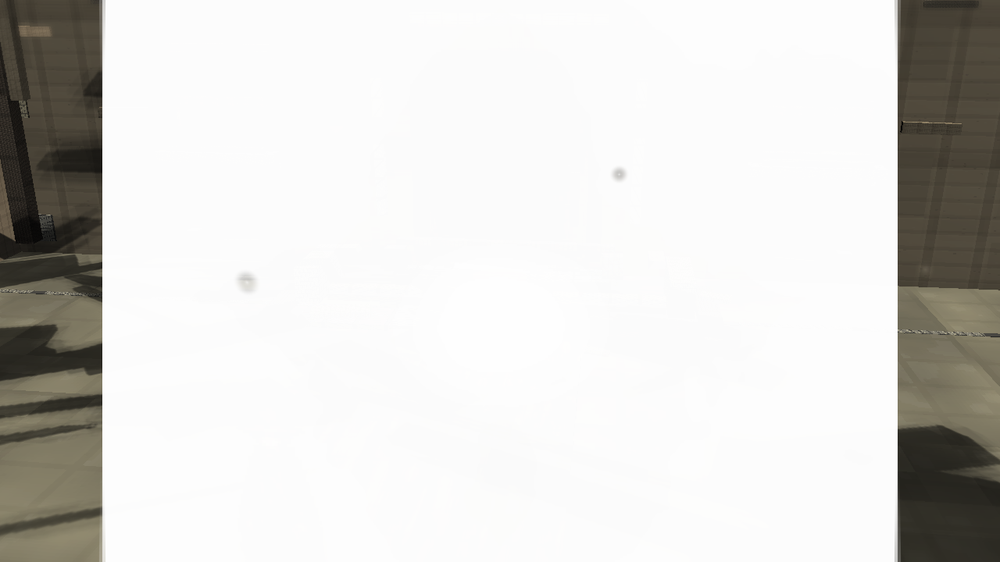
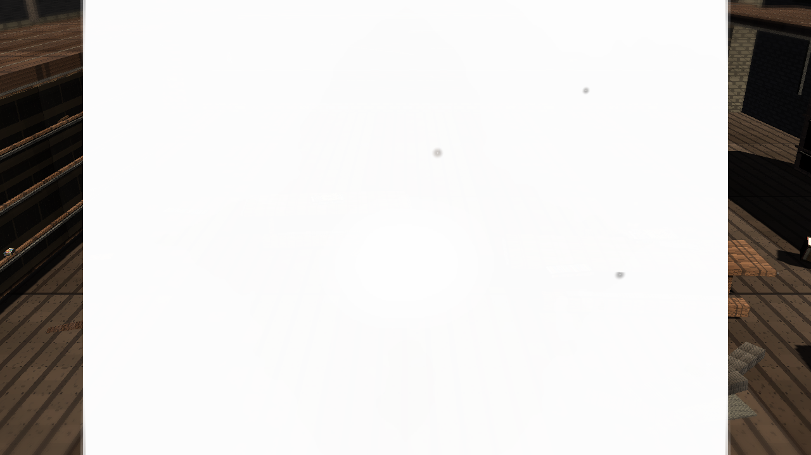
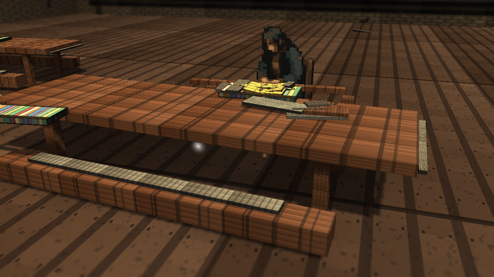
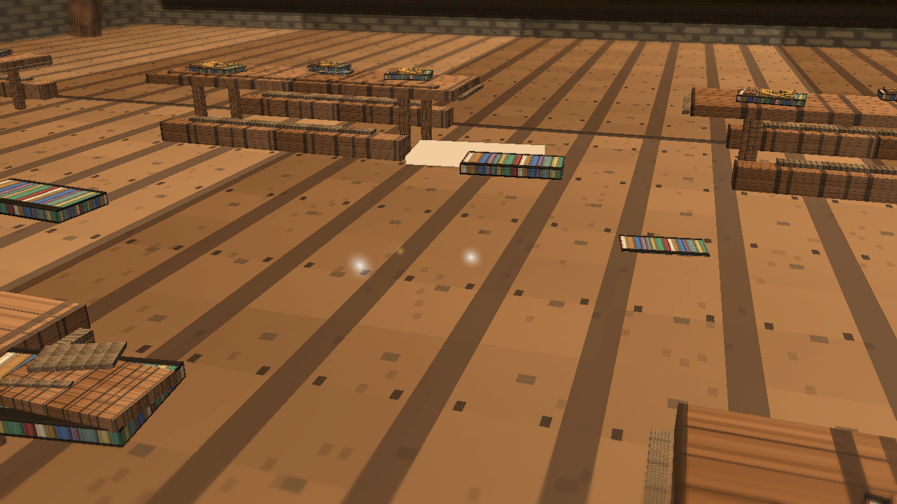
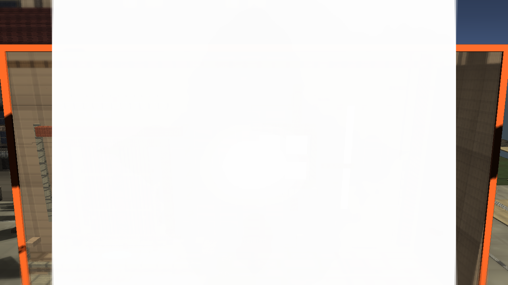

# Stage 7f Library Warm Anchor

Branch: `work/fast-vs-hd2d-shading-foundation-20260522`

Build: `C:\Users\maro6\Documents\Unity\Anemora-fast-vs-v24-hd2d-work\Builds\FastVS_HouseSlice\Anemora_FastVS_HouseSlice.exe`

Launch the whole `Builds\FastVS_HouseSlice` folder, not the exe alone.

## Comparison

## Captures

## Validation

- Single validate: `Logs/stage7-library-warm-anchor-validate-single.log`, exit 0.
- Full validate: `Logs/stage7-library-warm-anchor-validate-full-gfx.log`, exit 0.
- Capture: `Logs/stage7-library-warm-anchor-capture-gfx.log`, exit 0.
- Build: `Logs/stage7-library-warm-anchor-build-gfx.log`, exit 0.
- Smoke: `Logs/stage7-library-warm-anchor-smoke.log`, killed after 20 seconds, error-pattern match count 0.
- `PortalStencilFeature` was active in `UniversalRenderPipeline_Renderer.asset`.
- Paired-space roots, `TimeWindowPairedSpacePortalController`, Stage 7 APV volumes, and Stage 7 library warm anchor objects were present in the generated scene before cleanup.
- TimeWindow aperture was visually checked and was not black.

## Gap Notes

- The added warm anchor is still a local overlay cluster, not a physically convincing interior light source.
- The library floor, desk, books, and walls still read as tiled block geometry with limited material response.
- The reference night-camp image has a much clearer fire-lit focal hierarchy, spatial fog, and painterly shadow grouping than this stage.
- Overall HD-2D depth, authored composition, and atmosphere remain far below the target images.
