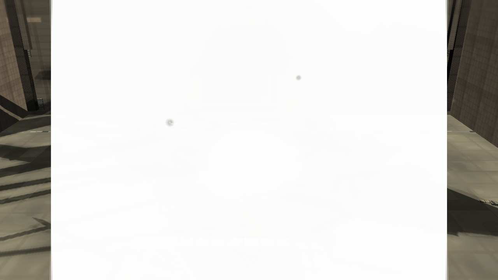
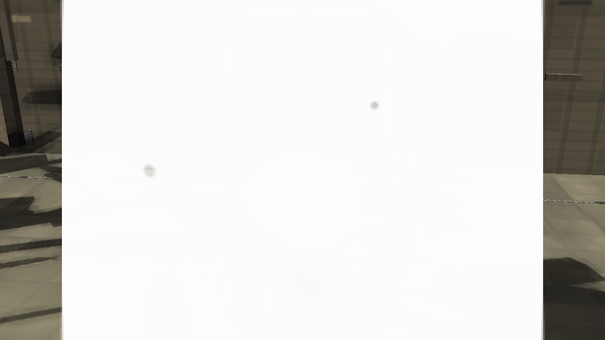
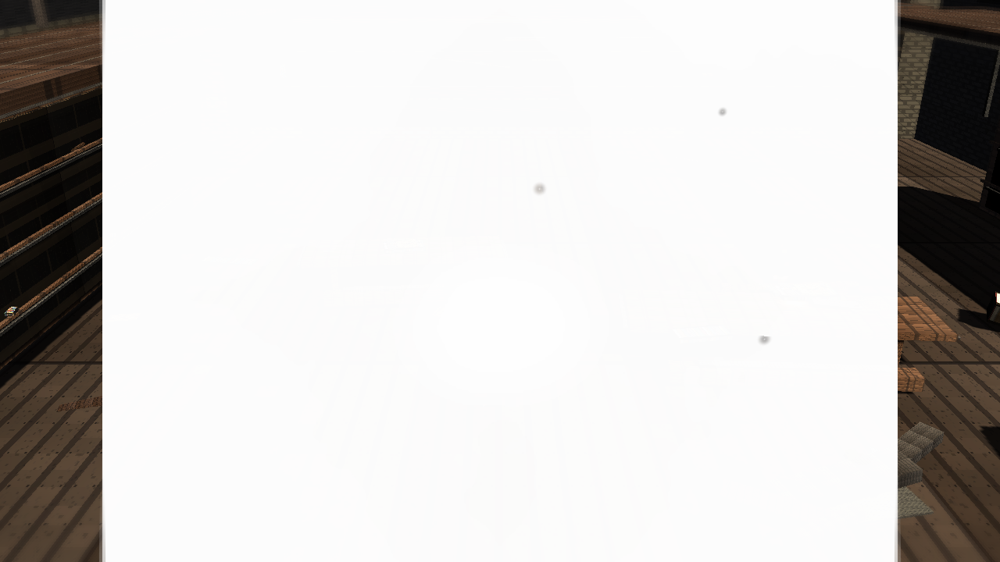
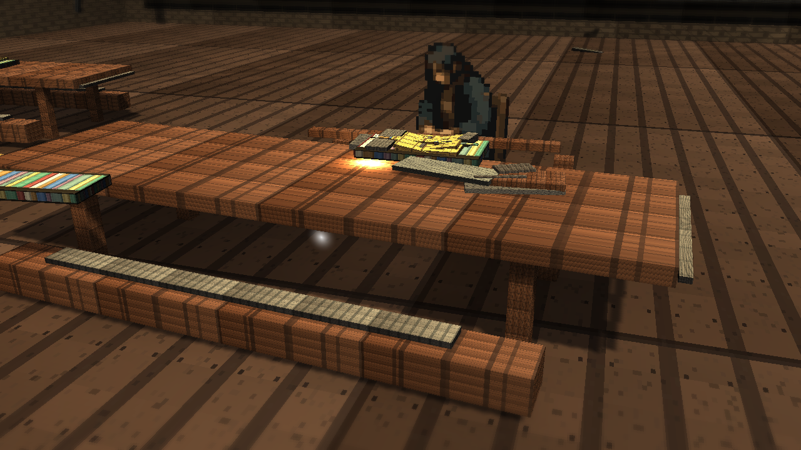
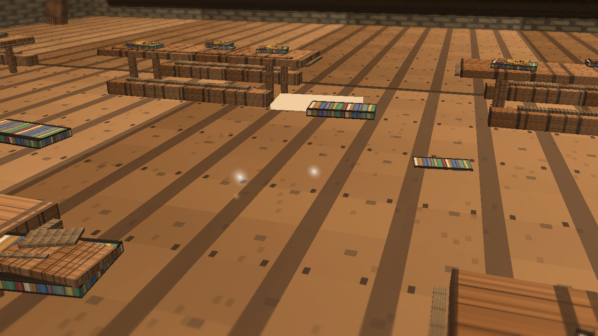
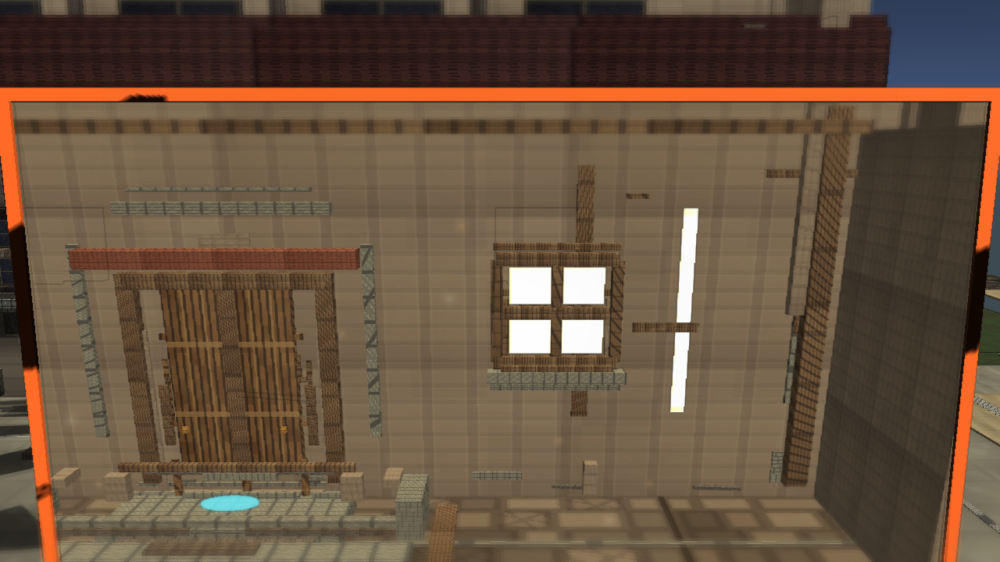

# Stage 7g Library Local Warm Light

Branch: `work/fast-vs-hd2d-shading-foundation-20260522`

Build: `C:\Users\maro6\Documents\Unity\Anemora-fast-vs-v24-hd2d-work\Builds\FastVS_HouseSlice\Anemora_FastVS_HouseSlice.exe`

Launch the whole `Builds\FastVS_HouseSlice` folder, not the exe alone.

## Captures

## Validation

- Single validate: `Logs/stage7-library-local-light-validate-single.log`, exit 0.
- Full validate: `Logs/stage7-library-local-light-validate-full-gfx.log`, exit 0.
- Capture: `Logs/stage7-library-local-light-capture-gfx.log`, exit 0.
- Build: `Logs/stage7-library-local-light-build-gfx.log`, exit 0.
- Smoke: `Logs/stage7-library-local-light-smoke.log`, killed after 20 seconds, error-pattern match count 0.
- `PortalStencilFeature` was active in `UniversalRenderPipeline_Renderer.asset`.
- Paired-space roots, `TimeWindowPairedSpacePortalController`, Stage 7 APV volumes, and Stage 7 library local warm light objects were present in the generated scene before cleanup.
- TimeWindow aperture was visually checked and was not black.

## Gap Notes

- The local warm light is still a small technical point light, not an authored fire/lamp composition.
- The library still lacks reference-level warm/cool separation, fog volume, dense prop silhouettes, and painterly shadow grouping.
- The floor, desk, and books remain visibly tiled/blocky, so the warm anchor does not overcome the material-quality gap.
- The plaza and exterior remain far below the reference wide-area HD-2D depth and atmosphere.
