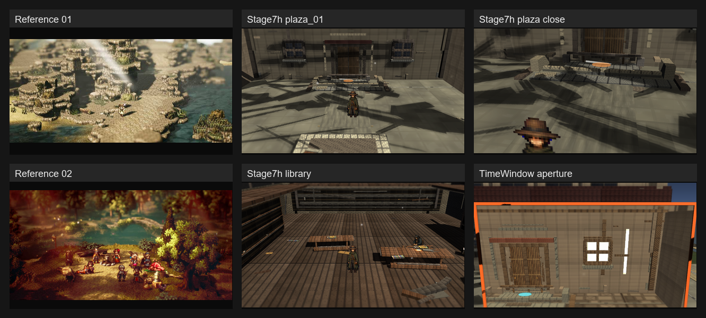
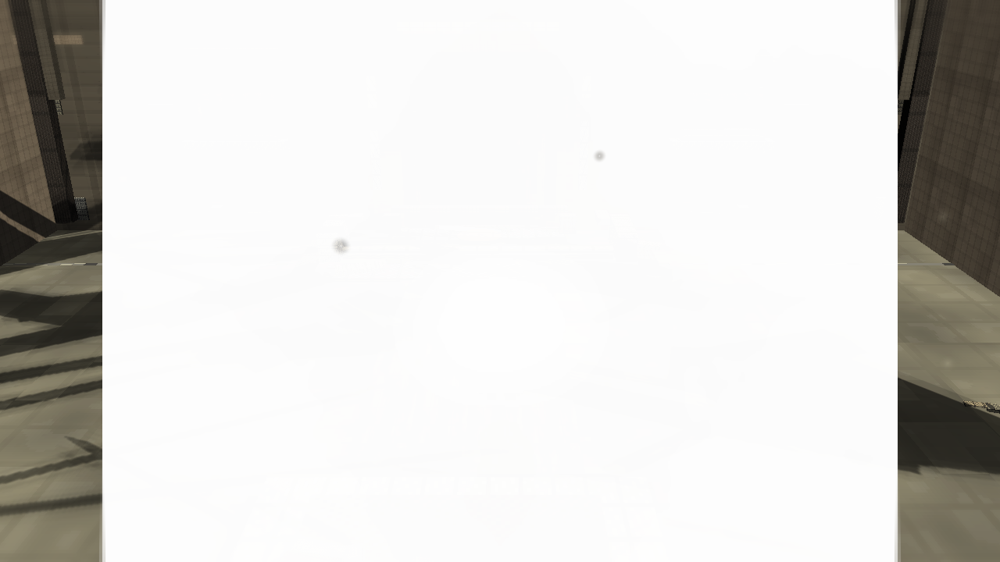
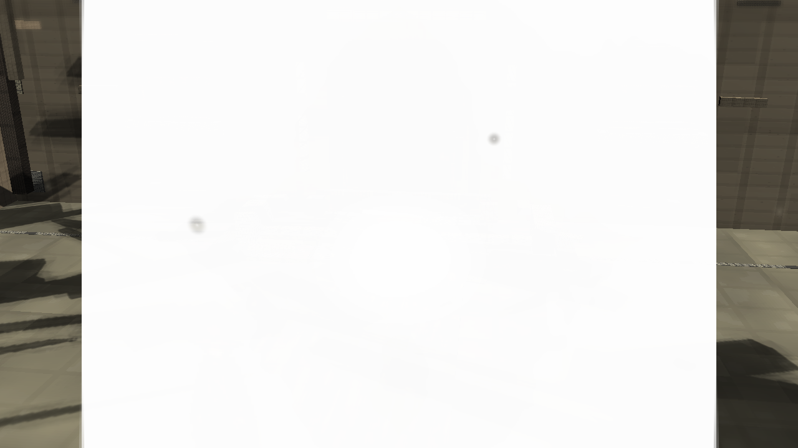
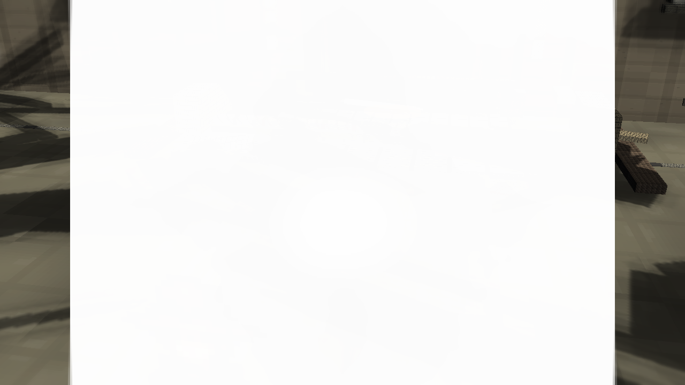
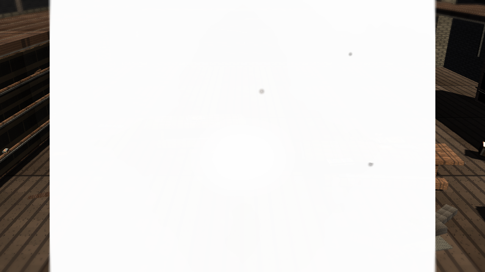
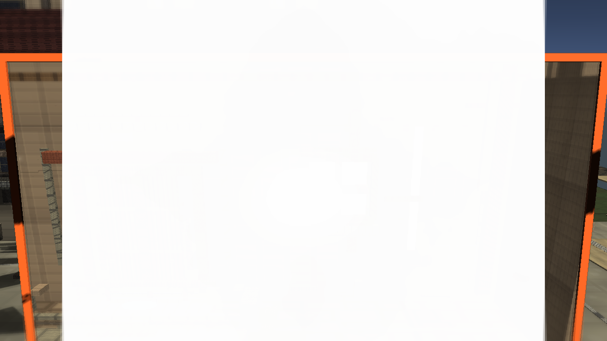

# Stage 7h Plaza Depth Bands

Branch: `work/fast-vs-hd2d-shading-foundation-20260522`

Stage 7h: Central Plaza floor depth bands. Reused existing plaza overlay materials only; no new material, texture, light, route, camera-runtime, APV, or TimeWindow logic was added.

Build: `C:\Users\maro6\Documents\Unity\Anemora-fast-vs-v24-hd2d-work\Builds\FastVS_HouseSlice\Anemora_FastVS_HouseSlice.exe`

Launch the whole `Builds\FastVS_HouseSlice` folder, not the exe alone.

## Comparison

## Captures

## Validation

- Single validate: `Logs/stage7-plaza-depth-bands-validate-single.log`, exit 0.
- Full validate: `Logs/stage7-plaza-depth-bands-validate-full-gfx.log`, exit 0.
- Capture: `Logs/stage7-plaza-depth-bands-capture-gfx.log`, exit 0.
- Build: `Logs/stage7-plaza-depth-bands-build-gfx.log`, exit 0.
- Smoke: `Logs/stage7-plaza-depth-bands-smoke.log`, killed after 20 seconds, error-pattern match count 0.
- `PortalStencilFeature` was active in `UniversalRenderPipeline_Renderer.asset`.
- Generated scene grep before cleanup found Stage 7h plaza depth bands, `TimeWindowPairedSpacePortalController`, Stage 7 APV volumes, and paired current/past plaza roots.
- TimeWindow aperture was visually checked and was not black.

## Gap Notes

- The added bands only make a modest floor-read change; they do not solve the oversized black shadow shapes dominating the plaza.
- The plaza still lacks reference-level miniature depth, terrain silhouette layering, vegetation density, and warm atmospheric separation.
- Wall and paving surfaces remain visibly tiled/blocky compared with the Octopath reference images.
- Library remains far below reference_02: no authored campfire composition, weak prop staging, limited warm/cool light hierarchy, and sparse atmosphere.
