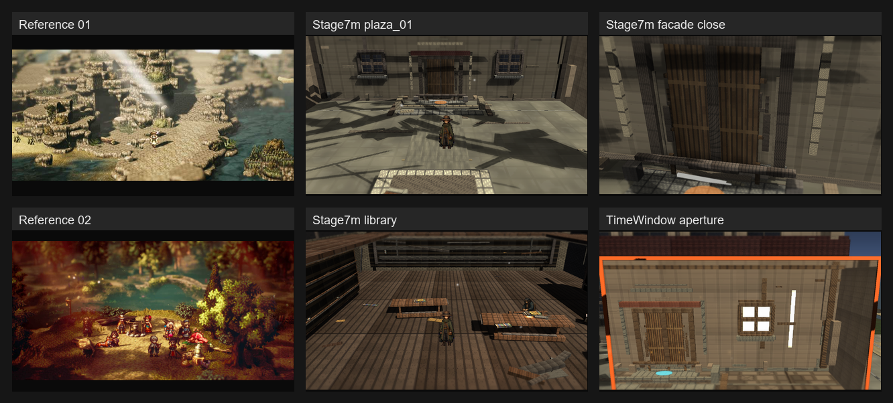

# Stage 7m Plaza Facade/Floor Relief

Branch: `work/fast-vs-hd2d-shading-foundation-20260522`

Build: `C:\Users\maro6\Documents\Unity\Anemora-fast-vs-v24-hd2d-work\Builds\FastVS_HouseSlice\Anemora_FastVS_HouseSlice.exe`

Launch note: launch the whole `C:\Users\maro6\Documents\Unity\Anemora-fast-vs-v24-hd2d-work\Builds\FastVS_HouseSlice` folder, not only the exe.

## Change

Stage7m adds restrained CentralPlaza library facade/floor relief in the generated scene path:

- Added non-arrival facade base/return relief and approach strip elements for current and past CentralPlaza.
- Used existing materials only; current floor/base relief was softened to `Dust` after the first capture made the added ledge too bright.
- Kept route triggers, route targets, route glow pads, runtime VS-like camera, realtime shadows, renderer features, and TimeWindow setup intact.
- Added Stage7m validate and capture editor batch methods.

## Images

- [home.png](home.png)
- [Home_outside.png](Home_outside.png)
- [plaza_01.png](plaza_01.png)
- [plaza_02_niro_in_shadow.png](plaza_02_niro_in_shadow.png)
- [plaza_facade_relief_close.png](plaza_facade_relief_close.png)
- [library.png](library.png)
- [tw_current_aperture.png](tw_current_aperture.png)

## Verification

- `ValidateHd2dStage7PlazaFacadeReliefBatch`: exit 0, `Logs/stage7-plaza-facade-relief-validate-single-r2.log`
- `ValidateHouseSliceBatch`: exit 0, `Logs/stage7-plaza-facade-relief-validate-full-gfx-r2.log`
- `CaptureHd2dStage7PlazaFacadeReliefReferenceScreenshotsBatch`: exit 0, `Logs/stage7-plaza-facade-relief-capture-gfx-r2.log`
- Build: exit 0, `Logs/stage7-plaza-facade-relief-build-gfx.log`, exe timestamp `2026-05-26 04:36:32`
- Build log note: Unity emitted the recurring non-fatal licensing access-token line; build result was Success and the exe timestamp updated.
- Smoke: killed after 20 seconds, error match count 0, `Logs/stage7-plaza-facade-relief-smoke.log`
- `PortalStencilFeature`: active in `Assets/Settings/UniversalRenderPipeline_Renderer.asset`
- Stage7 TiltShift and Outline renderer features: active.
- TimeWindow aperture PNG was viewed and is not black.
- Scene grep before cleanup found Stage7 facade relief objects, Stage7 depth bands, Stage7 shadow lift objects, Stage7 APV current/past volumes, CentralPlaza separate spaces, and `TimeWindowPairedSpacePortalController`.
- `Assets/Scenes/Anemora_Chapter1.unity` was not present, so no Chapter1 APPLY/INTEGRATOR/REFRESH pipeline was touched.

## Gap Notes

The target standard is still largely insufficient.

- The added facade/floor relief is visible but shallow; it does not convert the plaza into a layered HD-2D diorama.
- The large realtime shadow silhouettes still dominate the composition and flatten the reading of the plaza floor.
- The library facade still reads as a broad tiled wall with attached trim rather than a painterly environment with coherent depth hierarchy.
- The route glow pad remains visually strong in the close capture; it was not suppressed because route visibility must remain intact.
- Material richness, baked bounce, atmosphere, and reference-level color separation remain far below the Octopath-like references.

## Status

Proceeding to the next implementation slice. No code or asset commit was made for Stage7m; this review artifact is the only committed output for this checkpoint.
