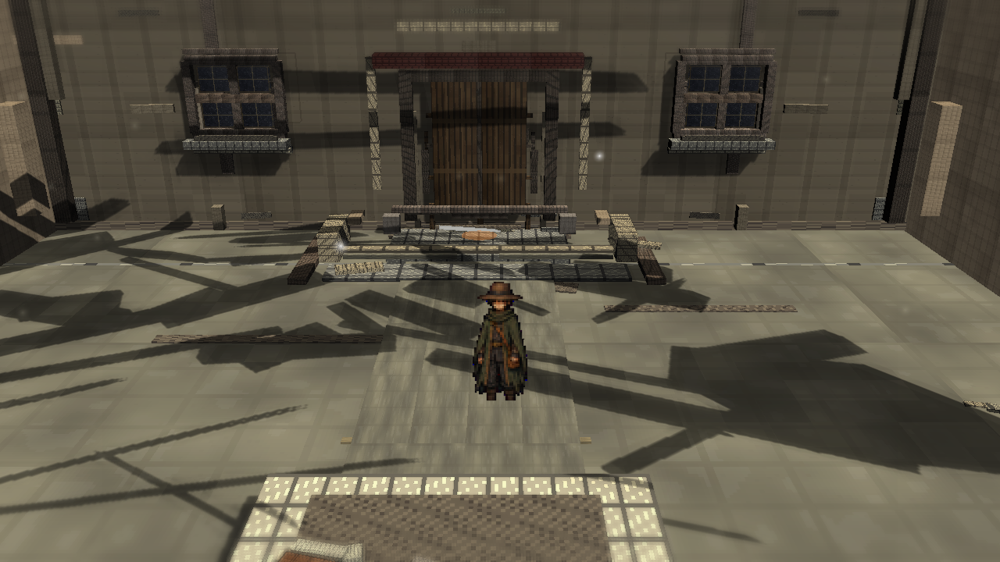
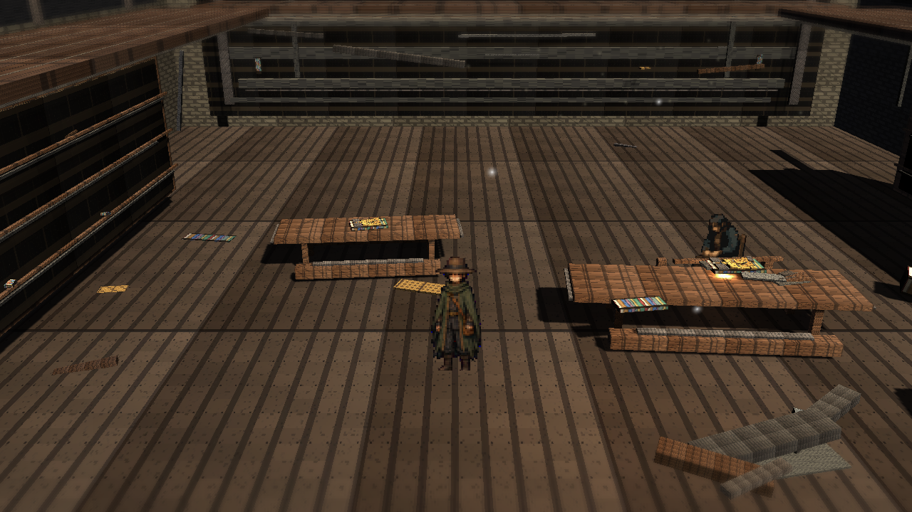
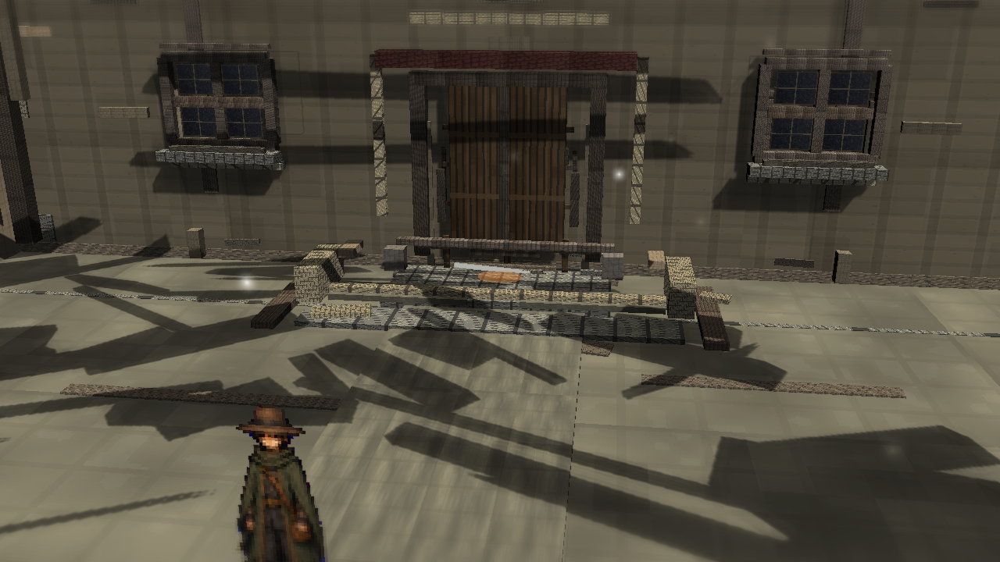
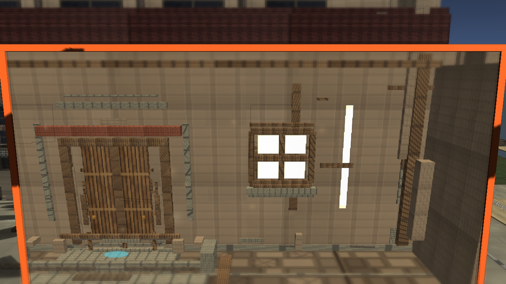

# Stage7o: Route Glow Subtlety

Branch: `work/fast-vs-hd2d-shading-foundation-20260522`

Stage7o reduced the current/past map-move and route-move glow pad alpha/scale while keeping the move points present. The change is deliberately narrow: it does not touch portal routing, triggers, camera behavior, or player movement.

## Build

`C:\Users\maro6\Documents\Unity\Anemora-fast-vs-v24-hd2d-work\Builds\FastVS_HouseSlice\Anemora_FastVS_HouseSlice.exe`

Launch the whole folder:

`C:\Users\maro6\Documents\Unity\Anemora-fast-vs-v24-hd2d-work\Builds\FastVS_HouseSlice`

## Capture

Capture output:

`C:\Users\maro6\OneDrive\work\projects\anemora_reference\reference\20260525_stage7_route_glow_subtlety`

Review images in this folder were re-saved as RGB PNGs so the branch viewer does not expose capture alpha artifacts.

## Verification

- `Anemora.EditorTools.AnemoraFastVsHouseSliceSetup.ValidateHd2dStage7RouteGlowSubtletyBatch`: passed.
- `Anemora.EditorTools.AnemoraFastVsHouseSliceSetup.CaptureHd2dStage7RouteGlowSubtletyReferenceScreenshotsBatch`: passed.
- `Anemora.EditorTools.AnemoraFastVsHouseSliceSetup.BuildAndValidateBatch`: passed.
- Player smoke: no `Exception`, `Error`, `Failed`, `NullReference`, `MissingReference`, or `Assertion` matches in `Logs\stage7-route-glow-subtlety-smoke.log`.
- `PortalStencilFeature` remained active in `Assets\Settings\UniversalRenderPipeline_Renderer.asset`.
- Paired-space objects and route glow pads were present in `Assets\Scenes\Anemora_FastVS_HouseSlice.unity`.
- `tw_current_aperture.png` was visually checked: aperture content is present, not black.
- `Assets\Scenes\Anemora_Chapter1.unity` is absent in this branch, so Chapter1 APPLY/INTEGRATOR/REFRESH did not apply.

## Images

## Gap Assessment

- The route glow pads are less visually dominant than before, but the current route close view is still led by a harsh white horizontal strip and hard-edged wall/floor construction.
- The plaza still reads as modular blockout with large mechanical shadows. It lacks the target reference's dense terrain detail, painterly local contrast, weathering, and atmospheric depth.
- The library remains sparse and broad. It does not approach the night-camp reference's localized warm light, layered silhouettes, foliage mass, or volumetric color separation.
- The TimeWindow aperture is not black, but the orange frame, bright window squares, and vertical white strip are still too loud relative to the scene.
- Home exterior still exposes roof and wall construction as flat assembled parts rather than integrated HD-2D materials.

This review is for branch-based docs/review inspection. Work should continue without blocking on self-approval.
