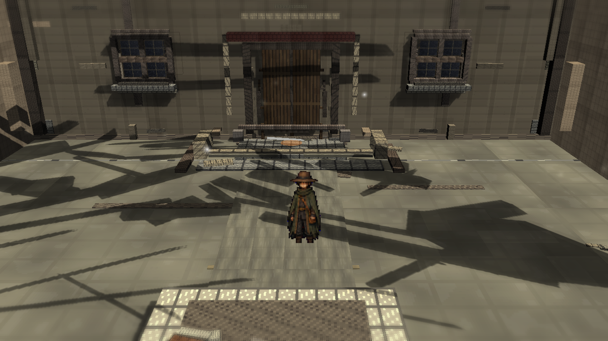
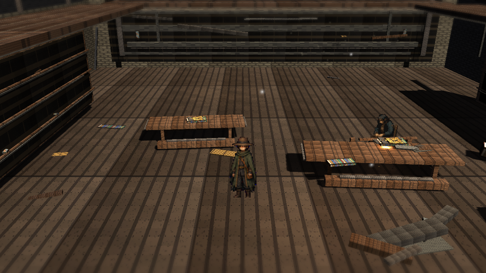
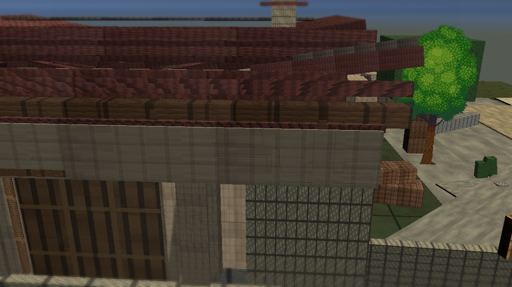
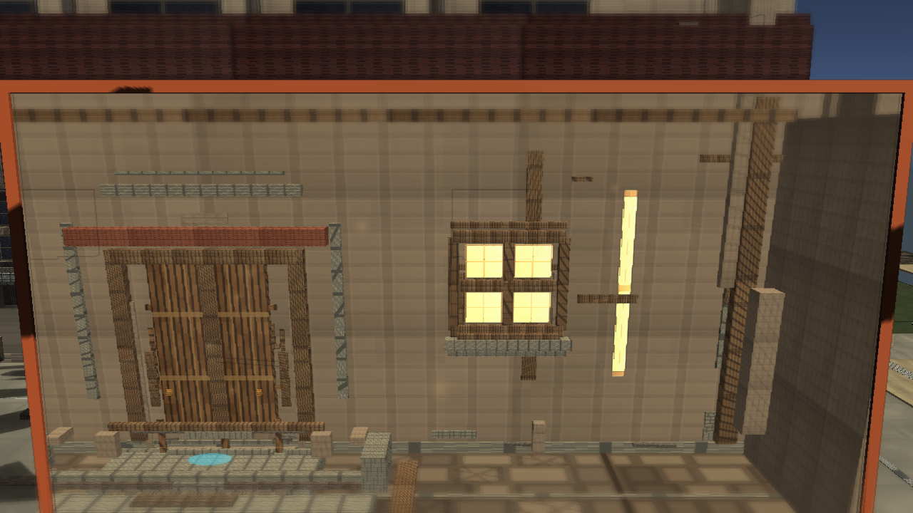
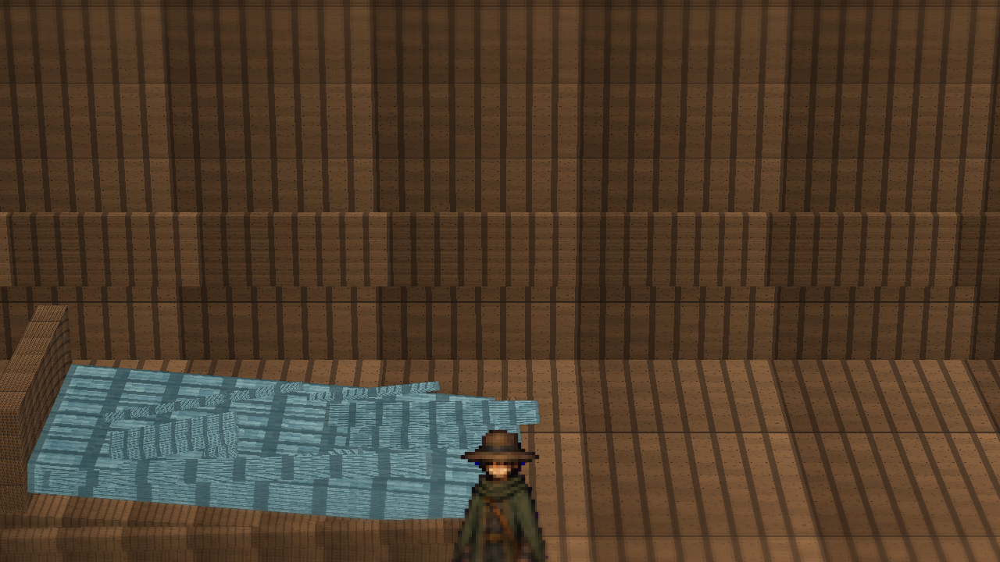
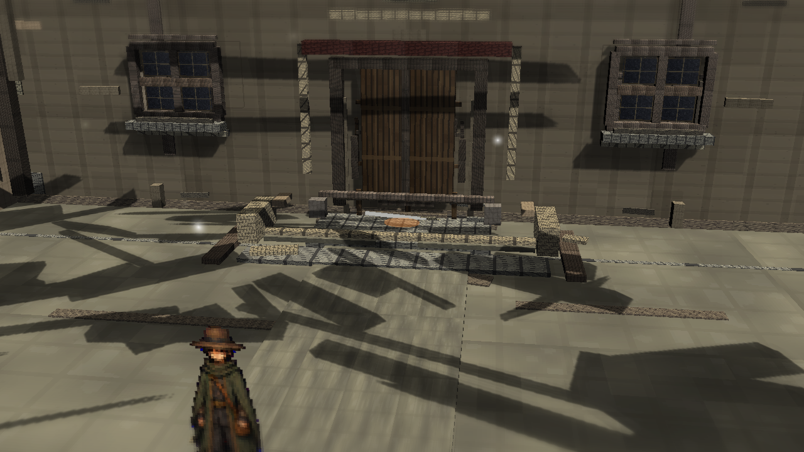

# Stage7p: Portal Facade Brightness

Branch: `work/fast-vs-hd2d-shading-foundation-20260522`

Stage7p reduces the TimeWindow portal frame and facade light glare. It darkens the current/past/preview frame colors, reduces warm/cool overlay pool alpha, and lowers the window-light emission baseline while preserving route and map move pads.

This is a narrow graphics pass. It does not touch portal routing, triggers, player movement, or runtime camera behavior.

## Build

`C:\Users\maro6\Documents\Unity\Anemora-fast-vs-v24-hd2d-work\Builds\FastVS_HouseSlice\Anemora_FastVS_HouseSlice.exe`

Launch the whole folder:

`C:\Users\maro6\Documents\Unity\Anemora-fast-vs-v24-hd2d-work\Builds\FastVS_HouseSlice`

## Capture

Capture output:

`C:\Users\maro6\OneDrive\work\projects\anemora_reference\reference\20260525_stage7_portal_facade_brightness`

Review images in this folder were re-saved as RGB PNGs so the branch viewer does not expose capture alpha artifacts.

## Verification

- `Anemora.EditorTools.AnemoraFastVsHouseSliceSetup.ValidateHd2dStage7PortalFacadeBrightnessBatch`: passed.
- `Anemora.EditorTools.AnemoraFastVsHouseSliceSetup.CaptureHd2dStage7PortalFacadeBrightnessReferenceScreenshotsBatch`: passed.
- `Anemora.EditorTools.AnemoraFastVsHouseSliceSetup.BuildAndValidateBatch`: passed.
- Player smoke: no `Exception`, `Error`, `Failed`, `NullReference`, `MissingReference`, or `Assertion` matches in `Logs\stage7-portal-facade-brightness-smoke.log`.
- Validate/capture/build logs include Unity licensing token noise; the Unity processes returned exit code 0.
- `PortalStencilFeature`, `FastVS HD2D Stage7 TiltShift`, `FastVS HD2D Soft Contact Occlusion`, and `FastVS HD2D Stage7 Outline` remained active in `Assets\Settings\UniversalRenderPipeline_Renderer.asset`.
- Paired-space objects and central plaza map move glow pads were present in `Assets\Scenes\Anemora_FastVS_HouseSlice.unity`.
- `tw_current_aperture.png` was visually checked: aperture content is present, not black.
- `Assets\Scenes\Anemora_Chapter1.unity` is absent in this branch, so Chapter1 APPLY/INTEGRATOR/REFRESH did not apply.

## Images

## Gap Assessment

- The TimeWindow frame and window glare are reduced, but the portal facade still reads as a large flat technical overlay instead of integrated HD-2D composition.
- The current route close view still contains a harsh white horizontal strip behind Niro. It remains one of the most visible non-reference-like artifacts.
- The plaza still has oversized mechanical shadows, flat modular wall/floor surfaces, sparse prop density, and little painterly terrain variation.
- The library still lacks the reference night camp's warm focal glow, layered silhouettes, volumetric separation, and material richness.
- Home exterior still exposes roof, wall, and ground as assembled blockout parts with insufficient weathering and depth.
- The aperture is not black, but the bright window panes and vertical strip continue to dominate more than the target references would allow.

This review is for branch-based docs/review inspection. Work continues without self-approval or blocking on this review entry.
