# Stage7q: Route Pad / Entry Strip Silhouette

Branch: `work/fast-vs-hd2d-shading-foundation-20260522`

Stage 7q: 広場から図書館へ向かうルートパッドと入口段差まわりを縮小・減光し、図書館前 close shot の過度な誘導発光と接地帯を抑えた。current 側の床・入口・ファサード下端は dust/shadow 寄りへ寄せ、capture helper は close review camera 移動後に Stage7 bokeh focus を再適用するようにした。

## Build

`C:\Users\maro6\Documents\Unity\Anemora-fast-vs-v24-hd2d-work\Builds\FastVS_HouseSlice\Anemora_FastVS_HouseSlice.exe`

フォルダごと起動:

`C:\Users\maro6\Documents\Unity\Anemora-fast-vs-v24-hd2d-work\Builds\FastVS_HouseSlice`

## Tom 撮影依頼

5 エリアスクショを以下へ:

`C:\Users\maro6\OneDrive\work\projects\anemora_reference\reference\20260525_stage7_route_pad_silhouette`

Review 用には同 capture 出力を `docs/review/2026-05-26T12-32/` へ RGB PNG として再保存した。

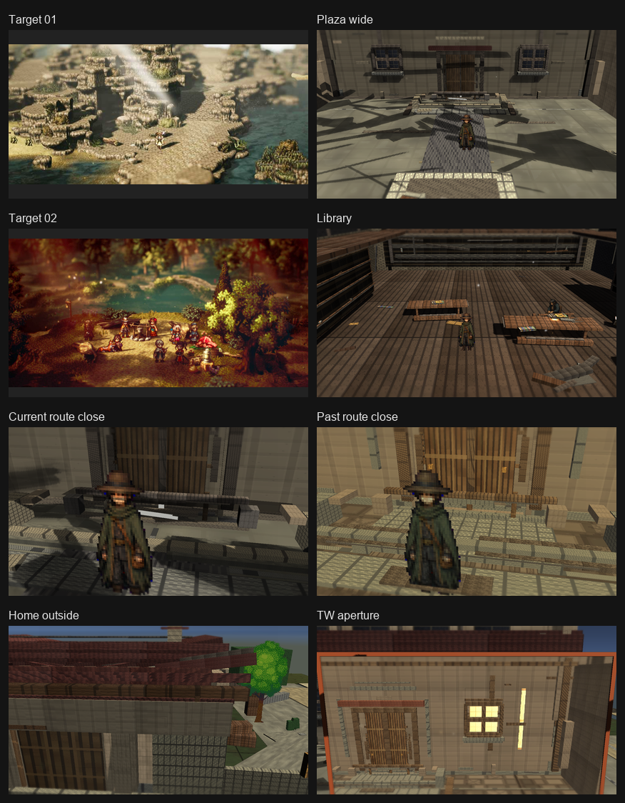

## Verification

- `Anemora.EditorTools.AnemoraFastVsHouseSliceSetup.ValidateHd2dStage7RoutePadSilhouetteBatch`: exit 0.
- `Anemora.EditorTools.AnemoraFastVsHouseSliceSetup.CaptureHd2dStage7RoutePadSilhouetteReferenceScreenshotsBatch`: exit 0.
- `Anemora.EditorTools.AnemoraFastVsHouseSliceSetup.BuildAndValidateBatch`: exit 0.
- Player smoke: `Logs\stage7-route-pad-silhouette-smoke-final.log` に `Exception`, `Error`, `Failed`, `NullReference`, `MissingReference`, `Assertion` の一致なし。
- `PortalStencilFeature`, `FastVS HD2D Stage7 TiltShift`, `FastVS HD2D Soft Contact Occlusion`, `FastVS HD2D Stage7 Outline` は `Assets\Settings\UniversalRenderPipeline_Renderer.asset` 上で active。
- `Current_CentralPlazaMap_SeparateSpace`, `Past_CentralPlazaMap_SeparateSpace`, `TimeWindowPairedSpacePortalController`, current/past map move glow pad は `Assets\Scenes\Anemora_FastVS_HouseSlice.unity` 上で確認。
- `tw_current_aperture.png` は目視確認済み。黒落ちはしていないが、明るい縦窓と壁面の粗さは残る。
- `Assets\Scenes\Anemora_Chapter1.unity` はこの branch では absent。Chapter1 APPLY/INTEGRATOR/REFRESH 対象なし。

## Images

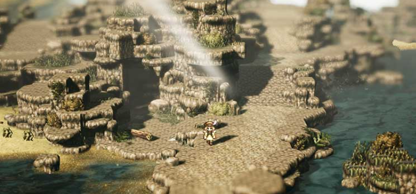

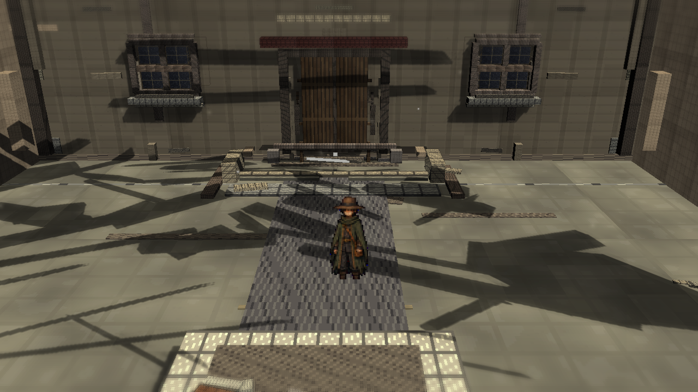

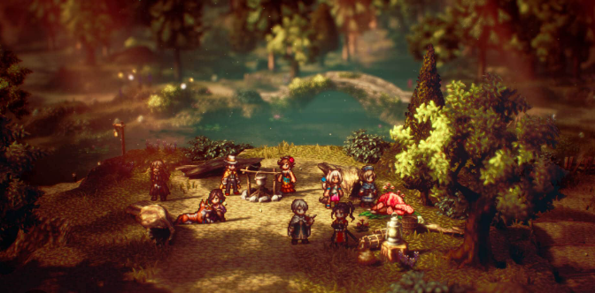

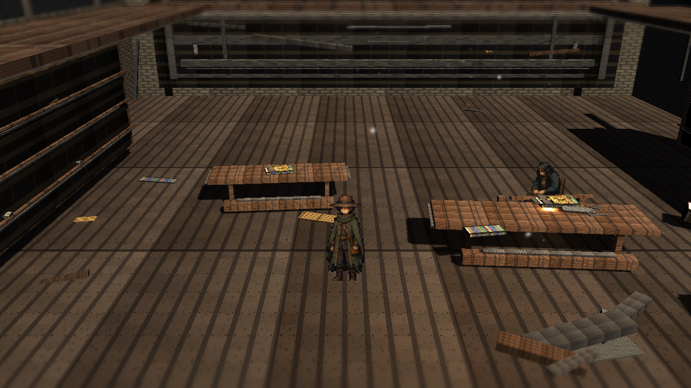

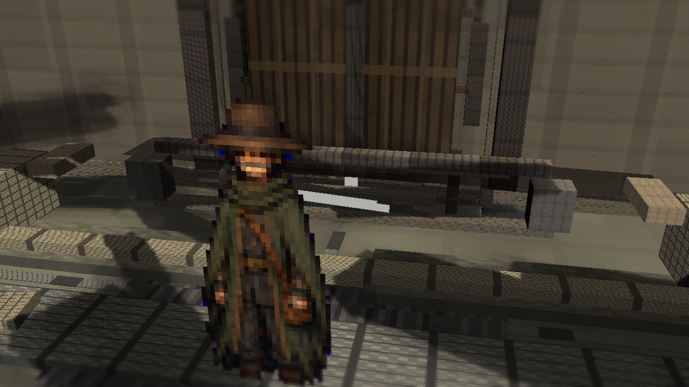

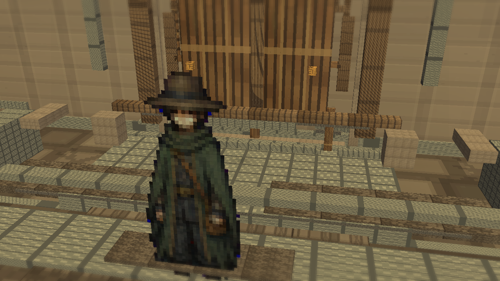

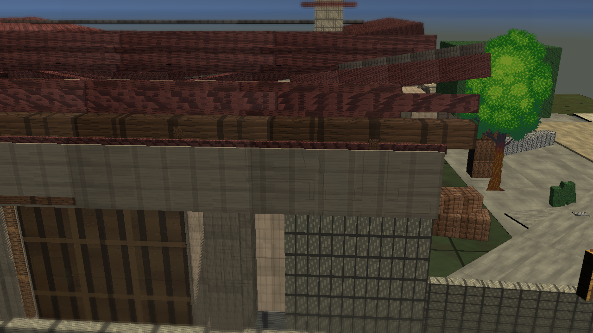

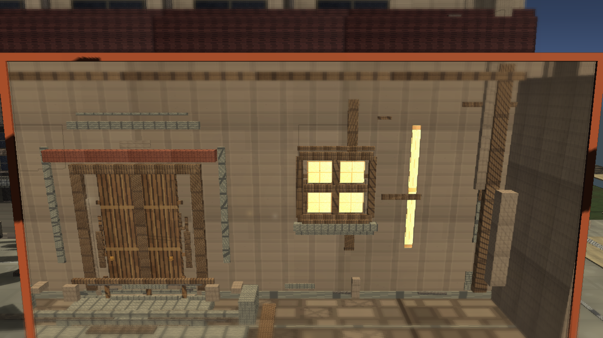

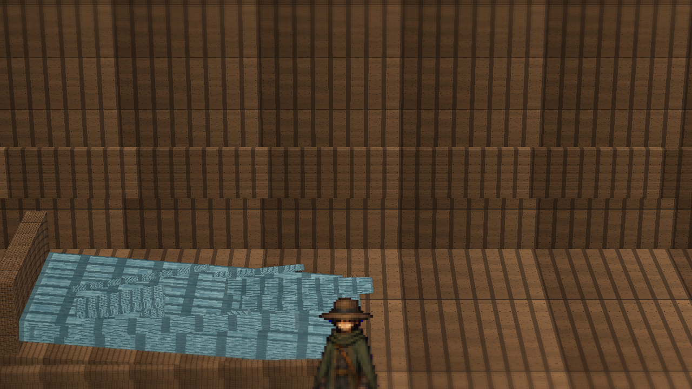

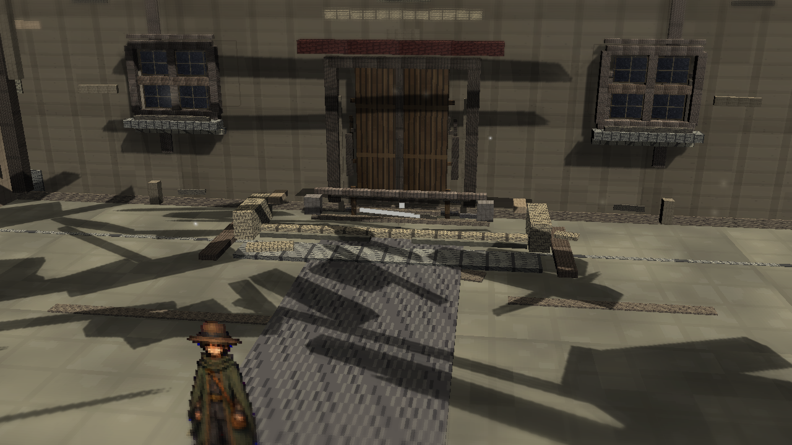

## 現状とのギャップ評価

- current route close の Niro 背後に白い水平・斜め帯がまだ残っている。今回の route pad/entry strip 側の縮小・減光では消えていない。
- close shot の Niro は画面内で大きく、ぼけ方も強く、背景との HD-2D レイヤー分離よりも artifact として目立つ。
- 広場全体は床・壁・段差がまだモジュール部品の組み合わせに見え、Octopath 参考画像の地形密度、塗り、空気遠近、視線誘導には届いていない。
- 図書館ファサードは接地帯を抑えても巨大な平面壁として読まれ、窓・柱・壁面の明暗階調が参考画像の手描き密度に足りない。
- TimeWindow aperture は黒落ちしていないが、明るい縦窓と硬い壁面境界が視線を奪い、portal 表現が背景に馴染んでいない。
- library/home exterior もライト、影、fog、prop density、material variation が不足しており、目標 HD-2D 基準に対して大幅不足。

判定待ち。ただし停止指示があるまで次サイクルの作業は継続する。
