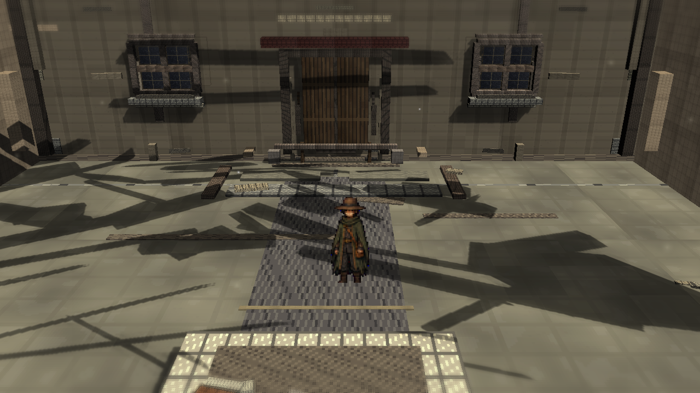
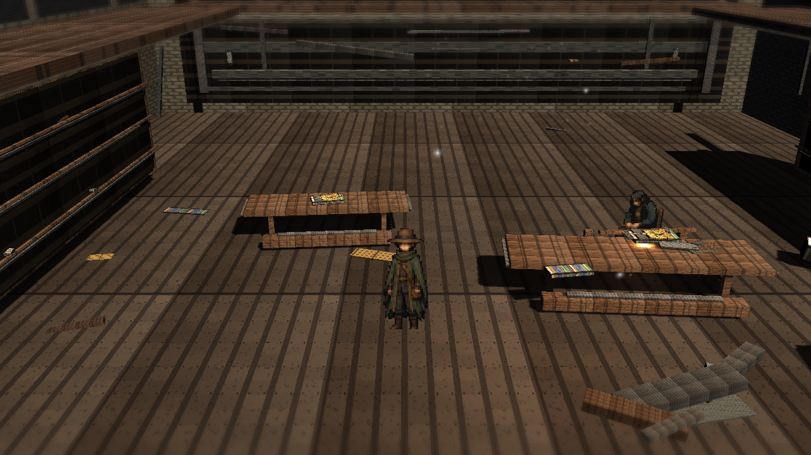
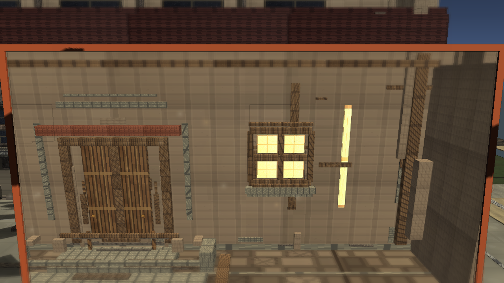
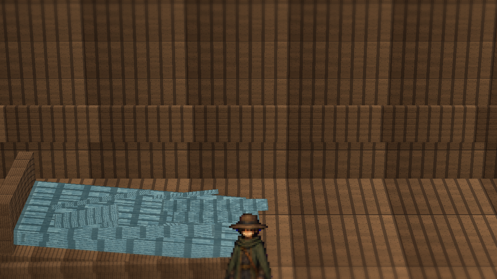
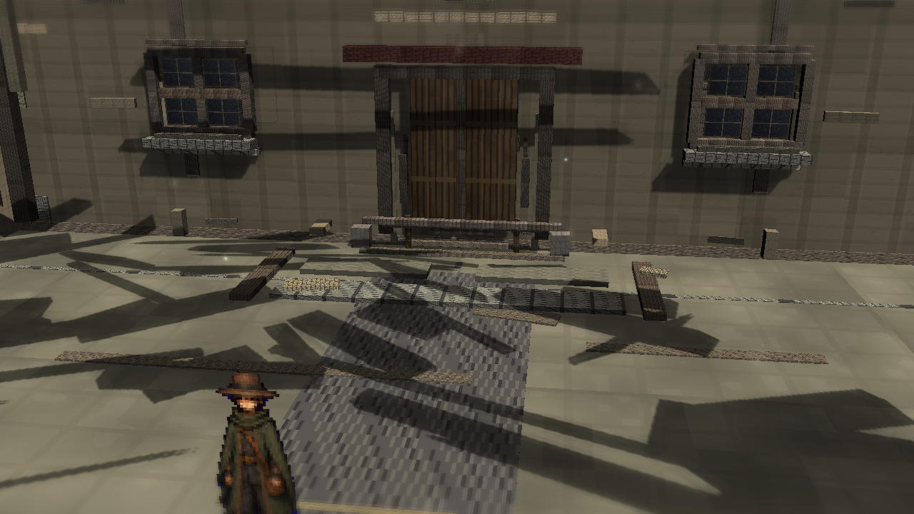

# Stage7r: Route-Close Artifact Cleanup

Branch: `work/fast-vs-hd2d-shading-foundation-20260522`

Stage 7r: Removed the close-route white/gray strip artifact pass and reduced the library entrance threshold / door relief pieces that were reading as bright geometric noise behind Niro. Current-side library entry plinth and threshold surfaces are pushed toward shadow/dust instead of pale stone.

## Build

`C:\Users\maro6\Documents\Unity\Anemora-fast-vs-v24-hd2d-work\Builds\FastVS_HouseSlice\Anemora_FastVS_HouseSlice.exe`

Launch the whole folder: &#12501;&#12457;&#12523;&#12480;&#12372;&#12392;&#36215;&#21205;

`C:\Users\maro6\Documents\Unity\Anemora-fast-vs-v24-hd2d-work\Builds\FastVS_HouseSlice`

## Tom Capture Request

5 area screenshots to:

`C:\Users\maro6\OneDrive\work\projects\anemora_reference\reference\20260525_stage7_route_pad_silhouette`

This review copy is stored under:

`docs/review/2026-05-26T21-10/`

## Verification

- `Anemora.EditorTools.AnemoraFastVsHouseSliceSetup.ValidateHd2dStage7RoutePadSilhouetteBatch`: exit 0.
- `Anemora.EditorTools.AnemoraFastVsHouseSliceSetup.CaptureHd2dStage7RoutePadSilhouetteReferenceScreenshotsBatch`: exit 0.
- `Anemora.EditorTools.AnemoraFastVsHouseSliceSetup.BuildAndValidateBatch`: exit 0.
- Player smoke: `Logs\stage7r-route-close-artifact-smoke.log`, no matching smoke failures found.
- `PortalStencilFeature`, `FastVS HD2D Stage7 TiltShift`, `FastVS HD2D Soft Contact Occlusion`, and `FastVS HD2D Stage7 Outline` remain active in `Assets\Settings\UniversalRenderPipeline_Renderer.asset`.
- `Current_CentralPlazaMap_SeparateSpace`, `Past_CentralPlazaMap_SeparateSpace`, `TimeWindowPairedSpacePortalController`, and current/past route glow pads are present in `Assets\Scenes\Anemora_FastVS_HouseSlice.unity`.
- `tw_current_aperture.png` was visually checked: aperture content is present and not black.
- `Assets\Scenes\Anemora_Chapter1.unity` is absent on this branch, so Chapter1 APPLY / INTEGRATOR / REFRESH did not apply.

## Images

## Current Gap Evaluation

- The previous Stage7q white diagonal / horizontal strip and white rectangle artifacts behind Niro in the current route-close screenshot are no longer visible.
- The close-route shot still reads like an oversized, blurred sprite over flat modular geometry. It does not yet have the reference image's layered miniature depth.
- The library facade remains broad and planar. Wall, door, window, and ground material response is still much flatter than the Octopath reference target.
- Shadows still lack the reference-level contact logic, soft occlusion layering, and color separation. Several surfaces read as stacked construction pieces rather than painted terrain.
- The TimeWindow aperture is not black, but it still exposes rough vertical repetition, hard wall boundaries, and a portal presentation that does not blend naturally into the scene.
- Home exterior, plaza, and library screenshots are still substantially below the HD-2D target in lighting density, fog/depth staging, material variation, and composition.

Judgment pending. Work continues until an explicit stop instruction.
