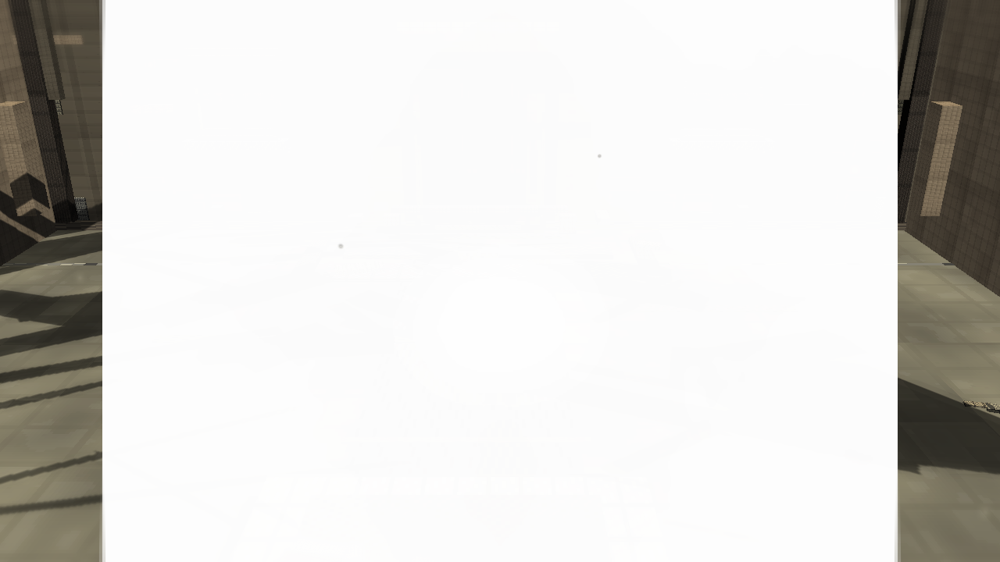
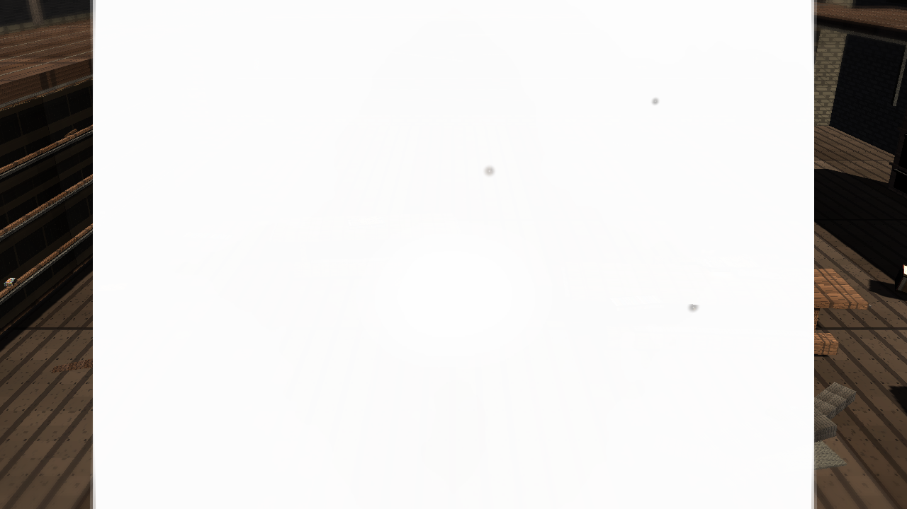
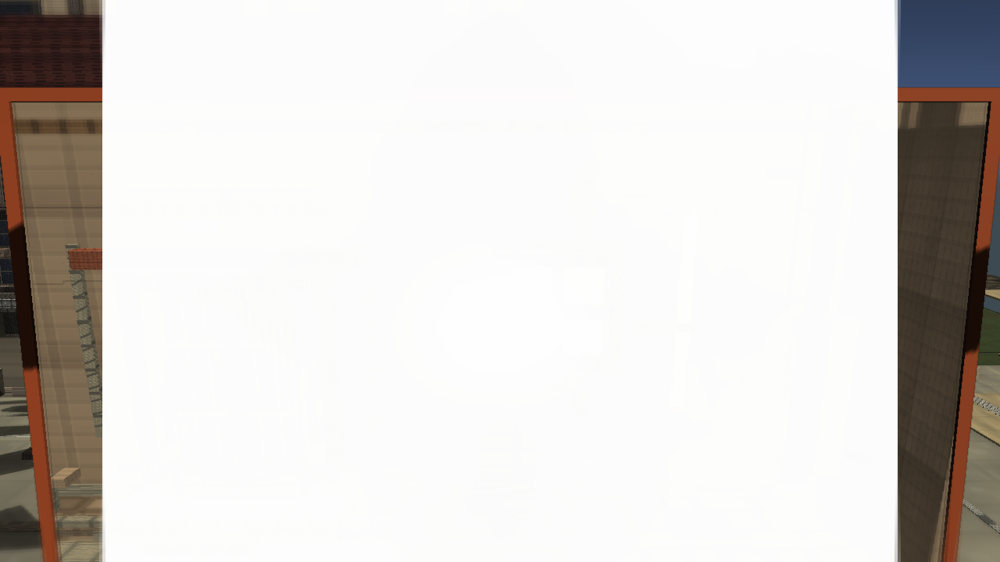
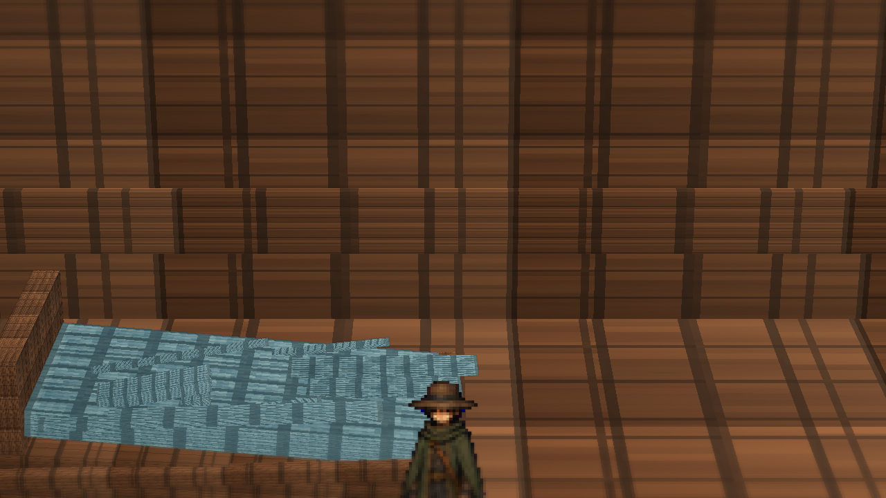
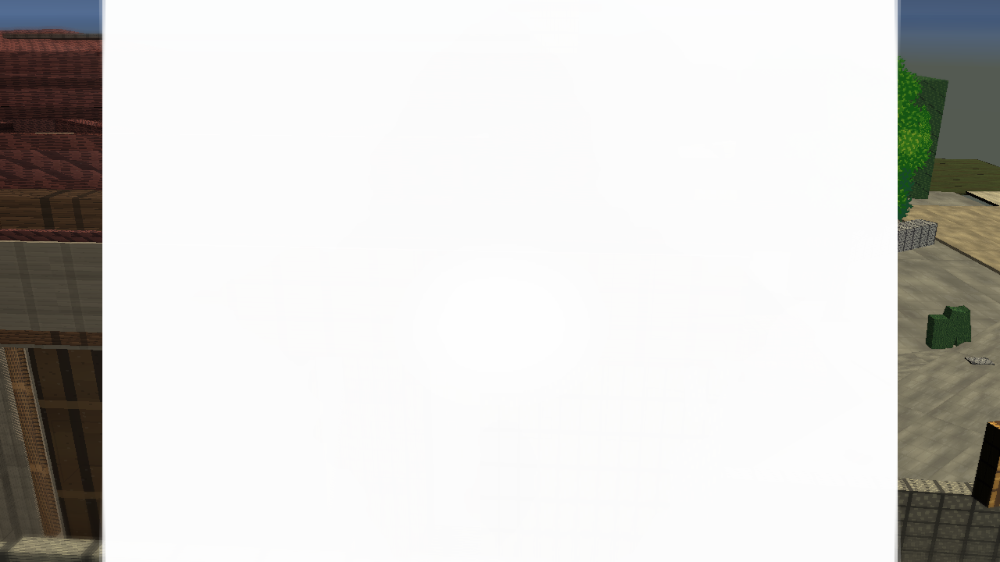
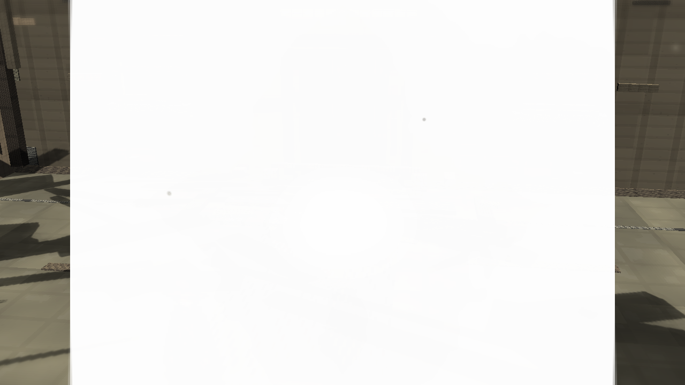

# Stage7s: Aperture Frame Blend

Branch: `work/fast-vs-hd2d-shading-foundation-20260522`

Stage7s darkens the current TimeWindow aperture frame and threshold material colors while preserving portal routing, paired-space setup, route pads, and the Stage7 renderer features.

## Build

`C:\Users\maro6\Documents\Unity\Anemora-fast-vs-v24-hd2d-work\Builds\FastVS_HouseSlice\Anemora_FastVS_HouseSlice.exe`

Launch the whole folder: **フォルダごと起動**

`C:\Users\maro6\Documents\Unity\Anemora-fast-vs-v24-hd2d-work\Builds\FastVS_HouseSlice`

## Capture

Internal capture output:

`C:\Users\maro6\OneDrive\work\projects\anemora_reference\reference\20260525_stage7s_aperture_frame_blend`

This public review copy intentionally excludes external target reference images, comparison boards, and obstructed route-close diagnostics.

## Verification

- `Anemora.EditorTools.AnemoraFastVsHouseSliceSetup.ValidateHd2dStage7ApertureFrameBlendBatch`: exit 0.
- `Anemora.EditorTools.AnemoraFastVsHouseSliceSetup.CaptureHd2dStage7ApertureFrameBlendReferenceScreenshotsBatch`: exit 0 with graphics enabled.
- `Anemora.EditorTools.AnemoraFastVsHouseSliceSetup.BuildAndValidateBatch`: Build Finished, Result: Success.
- Player smoke: `Logs\stage7s_aperture_frame_blend_smoke.log`, no `Exception`, `Error`, `Failed`, `NullReference`, `MissingReference`, or `Assertion` matches.
- `PortalStencilFeature`, `FastVS HD2D Stage7 TiltShift`, and `FastVS HD2D Stage7 Outline` are active in `Assets\Settings\UniversalRenderPipeline_Renderer.asset`.
- `Current_CentralPlazaMap_SeparateSpace`, `Past_CentralPlazaMap_SeparateSpace`, and `TimeWindowPairedSpacePortalController` are present in `Assets\Scenes\Anemora_FastVS_HouseSlice.unity`.
- `tw_current_aperture.png` was visually checked: aperture content is present, not black.

## Images

## Current Gap Evaluation

- The TimeWindow aperture frame is darker, but the portal still reads as a flat technical overlay with strong vertical repetition and hard boundaries.
- The plaza remains dominated by large mechanical shadow shapes and planar wall/floor construction.
- The library still lacks dense authored prop silhouettes, warm/cool atmospheric separation, and painterly material response.
- Home exterior still reads as assembled roof/wall geometry rather than integrated HD-2D environment art.
- Overall HD-2D depth, material richness, fog/depth staging, and composition remain substantially below the target.

Judgment pending. Work continues until an explicit stop instruction.
