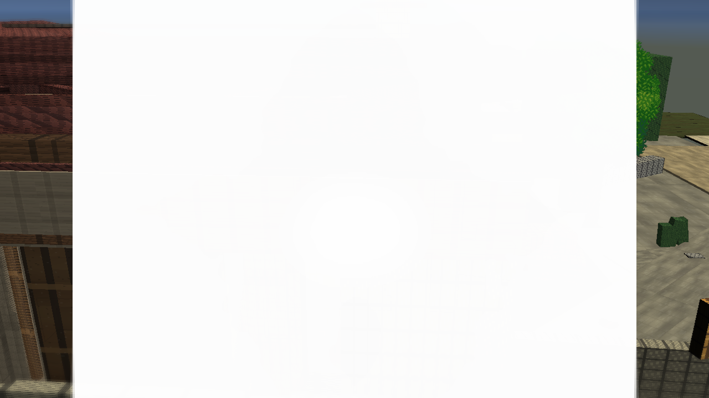
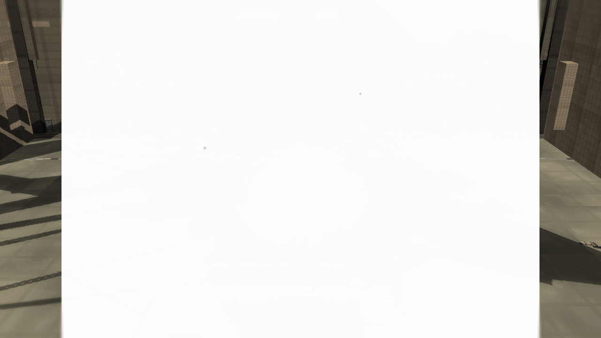
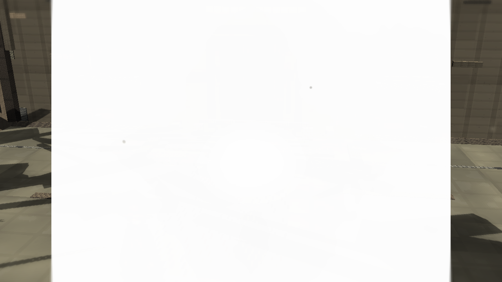
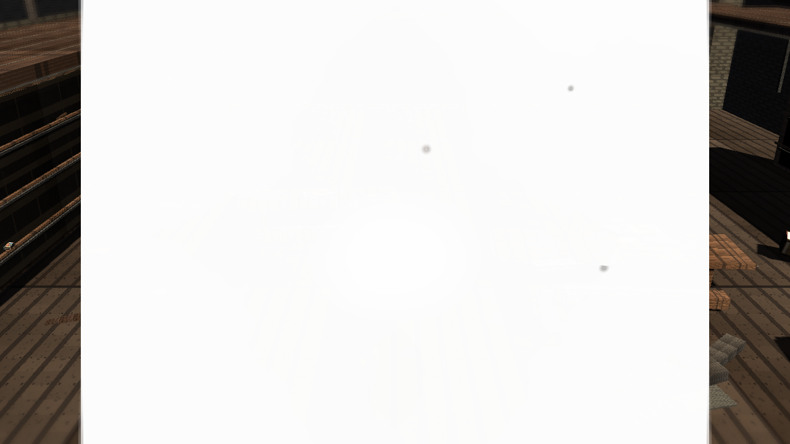
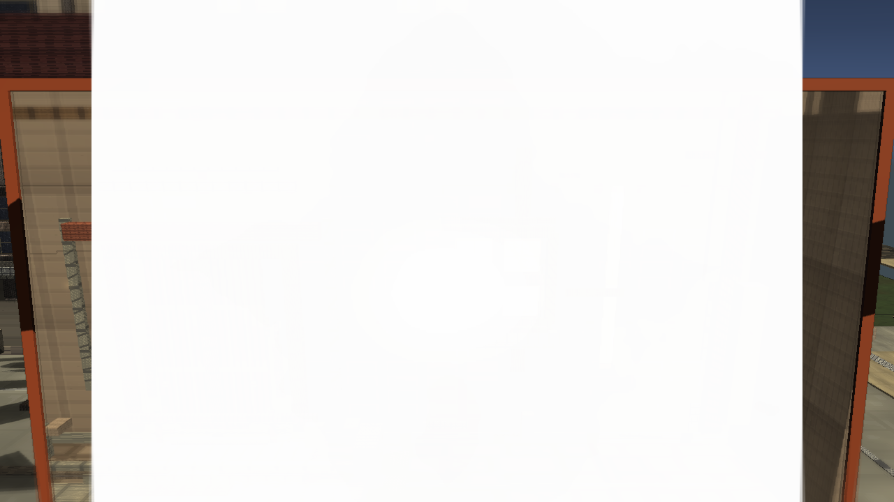

# Stage7t: Plan Conformance Settings Closure

Branch: `work/fast-vs-hd2d-shading-foundation-20260522`

Stage7t closes explicit numeric drift from the HD-2D implementation plan in the shared Volume Profile and URP shadow cascade settings. It does not change the public review rule: external game reference images and obstruction diagnostics are excluded.

## Build

`C:\Users\maro6\Documents\Unity\Anemora-fast-vs-v24-hd2d-work\Builds\FastVS_HouseSlice\Anemora_FastVS_HouseSlice.exe`

Launch the whole folder: **フォルダごと起動**

`C:\Users\maro6\Documents\Unity\Anemora-fast-vs-v24-hd2d-work\Builds\FastVS_HouseSlice`

## Capture

Internal capture output:

`C:\Users\maro6\OneDrive\work\projects\anemora_reference\reference\20260525_stage7s_aperture_frame_blend`

This public review copy intentionally excludes external target reference images, comparison boards, and route-close obstruction diagnostics.

## Verification

- `Anemora.EditorTools.AnemoraFastVsHd2dShadingFoundationAudit.VerifyShadingFoundationV1`: passed on the second run after disabling FilmGrain.
- `Anemora.EditorTools.AnemoraFastVsHouseSliceSetup.ValidateHouseSliceBatch`: exit 0.
- `Anemora.EditorTools.AnemoraFastVsHouseSliceSetup.CaptureHd2dStage7ApertureFrameBlendReferenceScreenshotsBatch`: exit 0 with graphics enabled.
- `Anemora.EditorTools.AnemoraFastVsHouseSliceSetup.BuildAndValidateBatch`: `Build Finished, Result: Success.`
- Player smoke: `Logs\stage7t_plan_conformance_smoke.log`, no `Exception`, `Error`, `Failed`, `NullReference`, `MissingReference`, or `Assertion` matches.
- Public image candidates were checked for central obstruction; close-route diagnostics were not copied.

## Images

## Current Gap Evaluation

- The postprocess/URP setup is now aligned with the explicit plan values, but this is a technical closure, not a visual sign-off.
- The plaza still depends on large, visibly mechanical shadow shapes and planar surfaces.
- The library remains sparse in dense authored prop silhouettes, warm/cool atmospheric separation, and painterly material response.
- The TimeWindow aperture is visible after the grade shift, but still reads as a flat technical overlay with hard boundaries.
- Overall HD-2D depth, material richness, fog/depth staging, and composition remain substantially below the target.

Judgment pending. Work continues until an explicit stop instruction.
