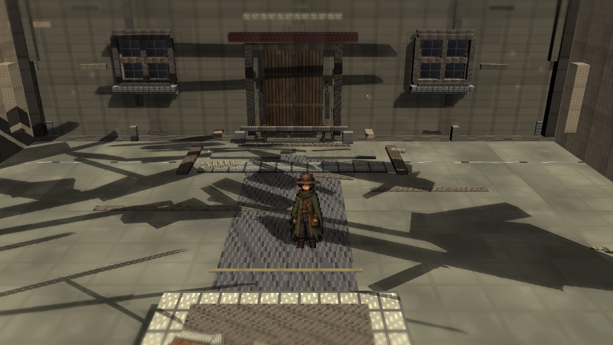
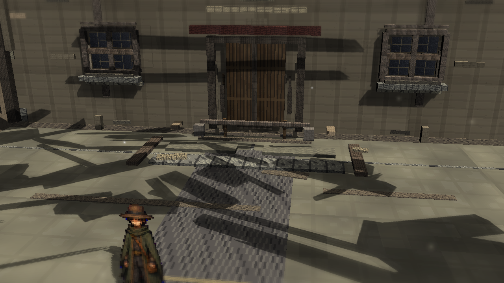
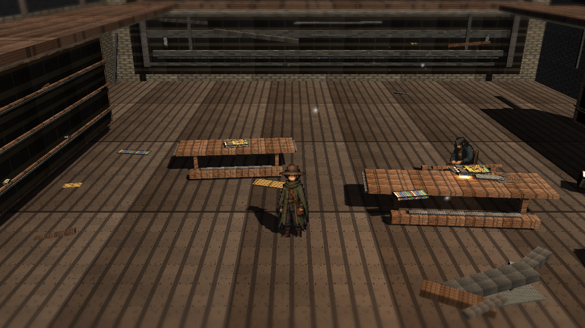
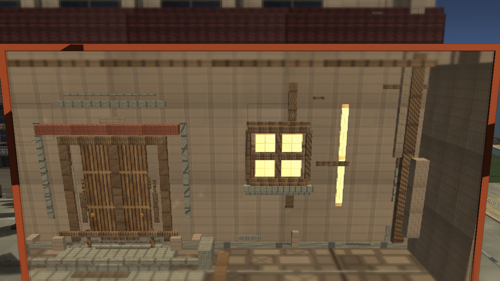

# Stage7v: APV Baked GI Evidence

Branch: `work/fast-vs-hd2d-shading-foundation-20260522`

Stage7v adds a repeatable APV baked-GI evidence path for the Fast VS house slice. The review captures below are public-facing scene checks for the baked APV cycle; they are not a final visual judgment.

## Build

`C:\Users\maro6\Documents\Unity\Anemora-fast-vs-v24-hd2d-work\Builds\FastVS_HouseSlice\Anemora_FastVS_HouseSlice.exe`

Launch the whole folder: **フォルダごと起動**

`C:\Users\maro6\Documents\Unity\Anemora-fast-vs-v24-hd2d-work\Builds\FastVS_HouseSlice`

## Capture

Internal capture output:

`C:\Users\maro6\OneDrive\work\projects\anemora_reference\reference\20260527_stage7v_apv_baked_gi`

This public review copy intentionally excludes external target reference images, comparison boards, and route-close obstruction diagnostics.

## Verification

- `Anemora.EditorTools.AnemoraFastVsHouseSliceSetup.ValidateHd2dStage7ApvBakedGiBatch`: exit 0, `8` baked cells.
- `Anemora.EditorTools.AnemoraFastVsHouseSliceSetup.CaptureHd2dStage7ApvBakedGiReferenceScreenshotsBatch`: exit 0 with graphics enabled.
- `Anemora.EditorTools.AnemoraFastVsHouseSliceSetup.BuildAndValidateBatch`: `Build Finished, Result: Success.`
- Player smoke: `Logs\stage7v_apv_baked_gi_smoke.log`, no exception or missing-reference matches.
- `01_current_plaza_to_library_route_glow_close.png` and `02_past_plaza_to_library_route_glow_close.png` were kept out of this public review set.

## Images

## Current Gap Evaluation

- APV now has baked cell evidence and build-time scene data, but the visible improvement remains limited by the surrounding authored art.
- The plaza still depends on large, mechanical shadow shapes and planar material treatment.
- The library remains sparse in prop density and painterly lighting response.
- The TimeWindow aperture still reads as a flat technical overlay in the current review capture.
- Overall HD-2D depth, material richness, fog/depth staging, and composition remain substantially below the target.

Judgment pending. Work continues until an explicit stop instruction.
