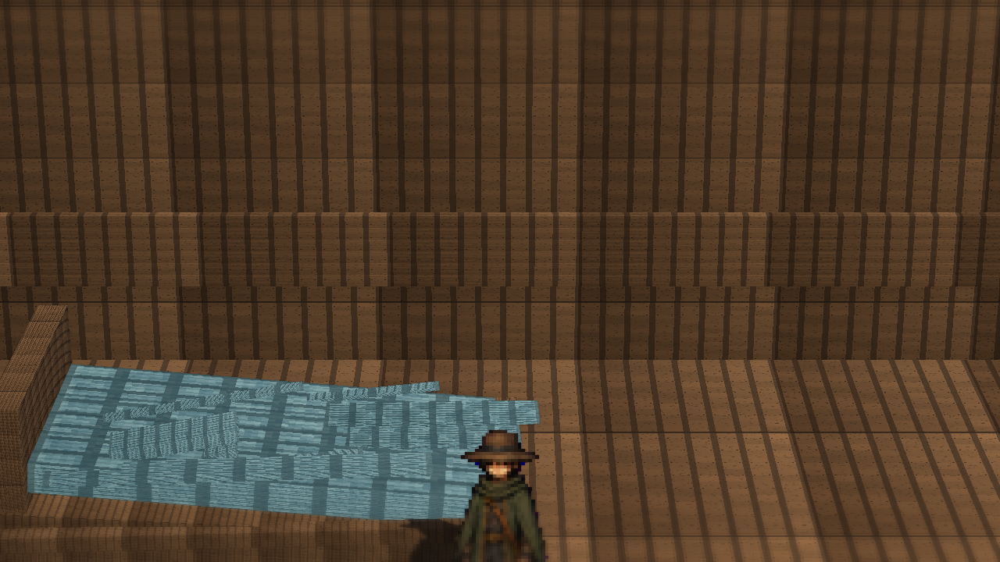
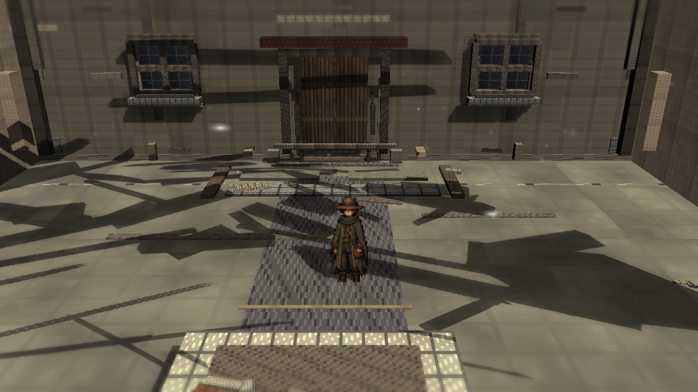
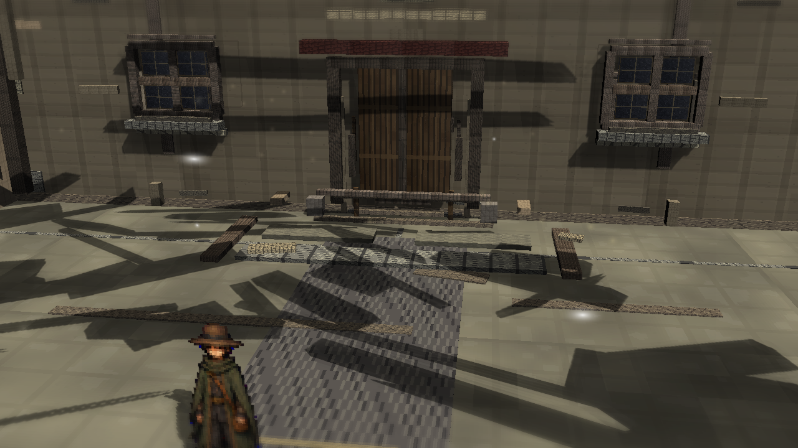
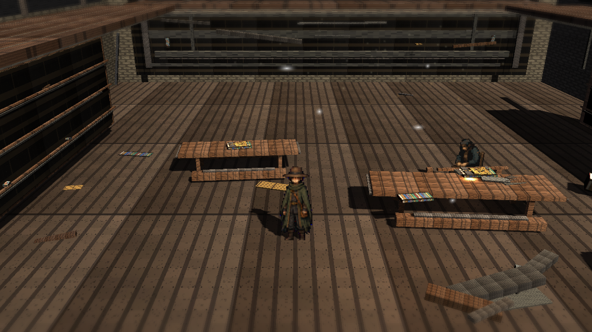
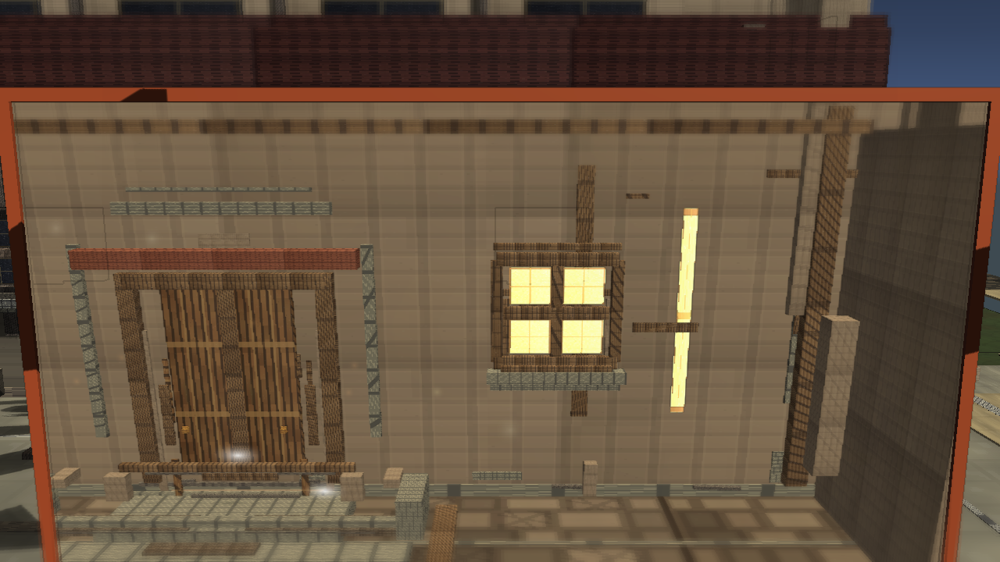

# Stage7w: Atmospheric Layering Fallback

Branch: `work/fast-vs-hd2d-shading-foundation-20260522`

Stage7w adds a low-count ParticleSystem fallback for richer plaza/library atmospheric layering. This is a public-facing review capture for the cycle, not a final visual judgment.

## Build

`C:\Users\maro6\Documents\Unity\Anemora-fast-vs-v24-hd2d-work\Builds\FastVS_HouseSlice\Anemora_FastVS_HouseSlice.exe`

Launch the whole folder: **フォルダごと起動**

`C:\Users\maro6\Documents\Unity\Anemora-fast-vs-v24-hd2d-work\Builds\FastVS_HouseSlice`

## Capture

Internal capture output:

`C:\Users\maro6\OneDrive\work\projects\anemora_reference\reference\20260527_stage7w_atmospheric_layering`

This public review copy intentionally excludes external target reference images, comparison boards, and route-close obstruction diagnostics.

## Verification

- `Anemora.EditorTools.AnemoraFastVsHouseSliceSetup.ValidateHd2dStage7AtmosphericLayeringBatch`: exit 0.
- `Anemora.EditorTools.AnemoraFastVsHouseSliceSetup.CaptureHd2dStage7AtmosphericLayeringReferenceScreenshotsBatch`: exit 0 with graphics enabled.
- `Anemora.EditorTools.AnemoraFastVsHouseSliceSetup.BuildAndValidateBatch`: `Build Finished, Result: Success.`
- Player smoke: `Logs\stage7w_atmospheric_layering_smoke.log`, no exception or missing-reference matches.
- Public image candidates were checked for central obstruction; route-close diagnostics were not copied.

## Images

## Current Gap Evaluation

- The added atmosphere is visible as sparse motes and thin veil layers, but this remains a ParticleSystem fallback rather than a VFX Graph implementation.
- The plaza still depends on large, visibly mechanical shadow shapes and planar surfaces.
- The library remains sparse in dense authored prop silhouettes, warm/cool atmospheric separation, and painterly material response.
- The TimeWindow aperture is visible, but still reads as a flat technical overlay with hard boundaries.
- Overall HD-2D depth, material richness, fog/depth staging, and composition remain substantially below the target.

Judgment pending. Work continues until an explicit stop instruction.
