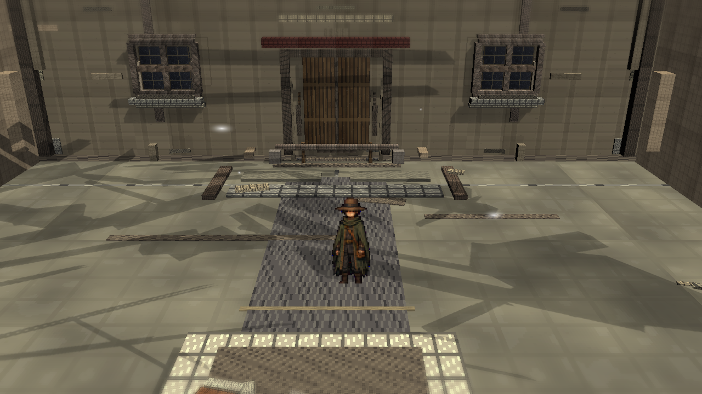
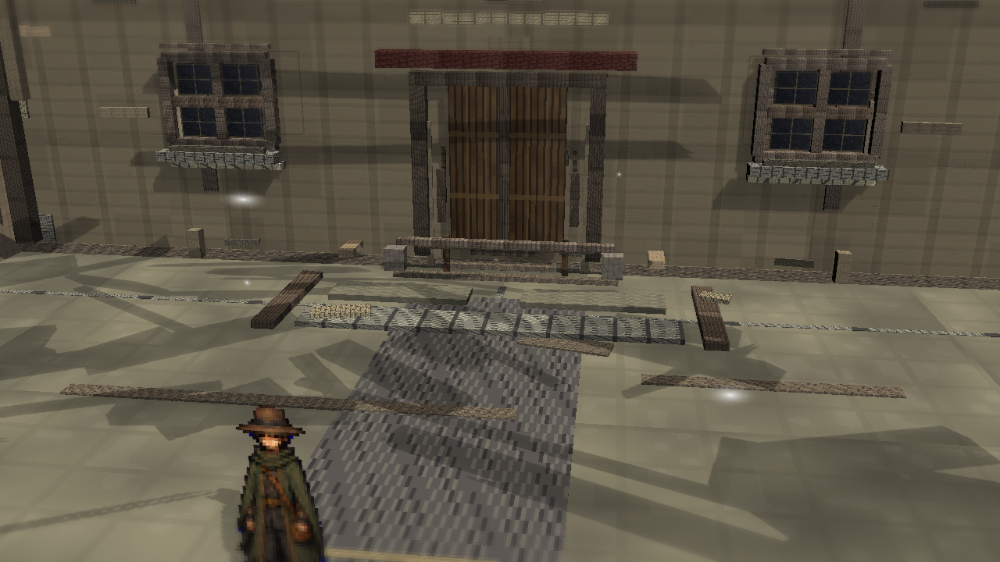
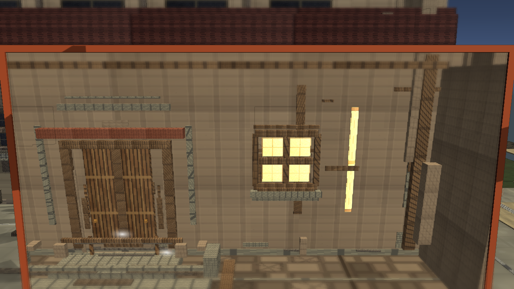

# Stage7x: Public Review Shadow Legibility

Branch: `work/fast-vs-hd2d-shading-foundation-20260522`

Stage7x reduces the black/dark mass that made the previous public review images hard to inspect. This is a curated public-facing review set for the cycle, not a final visual judgment.

## Build

`C:\Users\maro6\Documents\Unity\Anemora-fast-vs-v24-hd2d-work\Builds\FastVS_HouseSlice\Anemora_FastVS_HouseSlice.exe`

Launch the whole folder: **フォルダごと起動**

`C:\Users\maro6\Documents\Unity\Anemora-fast-vs-v24-hd2d-work\Builds\FastVS_HouseSlice`

## Capture

Internal capture output:

`C:\Users\maro6\OneDrive\work\projects\anemora_reference\reference\20260527_stage7x_public_review_shadow_legibility`

This public review copy intentionally excludes external target reference images, comparison boards, route-close obstruction diagnostics, and dark candidates whose image content is still difficult to inspect.

## Verification

- `Anemora.EditorTools.AnemoraFastVsHouseSliceSetup.ValidateHd2dStage7PublicReviewShadowLegibilityBatch`: exit 0.
- `Anemora.EditorTools.AnemoraFastVsHouseSliceSetup.CaptureHd2dStage7PublicReviewShadowLegibilityReferenceScreenshotsBatch`: exit 0 with graphics enabled.
- `Anemora.EditorTools.AnemoraFastVsHouseSliceSetup.BuildAndValidateBatch`: `Build Finished, Result: Success.`
- Public image candidates were measured for dark-region coverage; `home.png`, `Home_outside.png`, and `library.png` remain internal diagnostics for this cycle.

## Dark-Region Measurement

Compared with `docs/review/2026-05-27T01-42/`:

- `plaza_01.png`: central dark `<45` reduced from `0.215` to `0.081`.
- `plaza_02_niro_in_shadow.png`: central dark `<45` reduced from `0.277` to `0.099`.
- `tw_current_aperture.png`: central dark `<45` stayed low at `0.003`.

## Images

## Current Gap Evaluation

- The curated plaza shots are more legible, but the scene still relies on obvious planar shadow fields and coarse material response.
- Exterior and library candidates still contain too much dark mass for public review evidence and need further authored lighting/material work.
- Overall HD-2D depth, material richness, fog/depth staging, and composition remain substantially below the target.

Judgment pending. Work continues until an explicit stop instruction.
