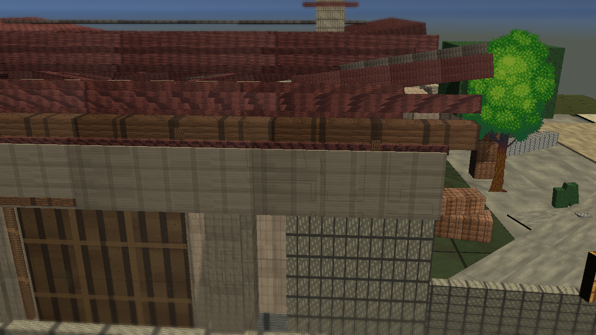
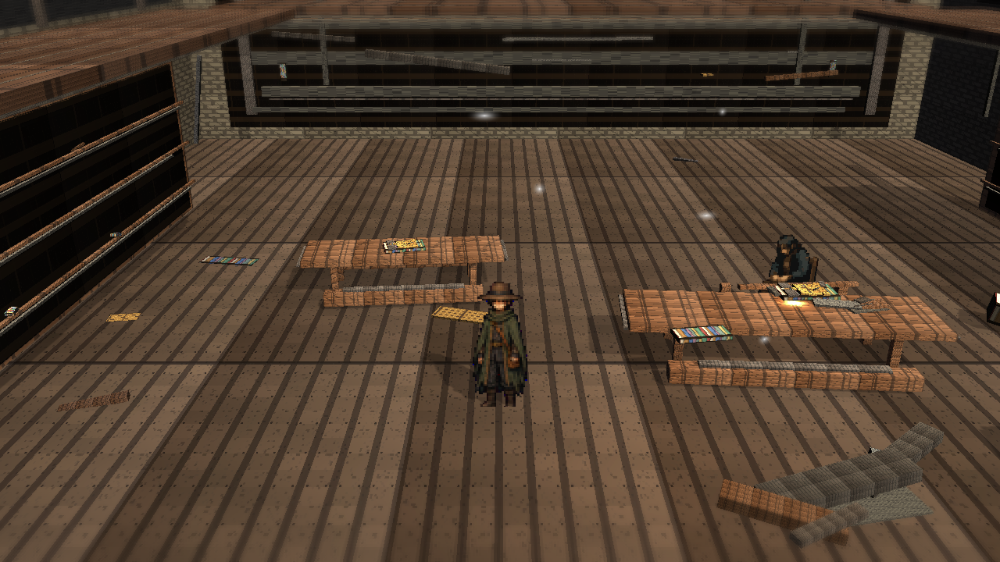

# Stage7y: Opaque Review PNGs and Exterior/Library Legibility

Branch: `work/fast-vs-hd2d-shading-foundation-20260522`

Stage7y addresses the public-review black-image report. The main defect was PNG alpha: original RGB content existed, but public thumbnails were generated through transparent alpha and became black. This review set was regenerated with opaque PNG alpha and is still not a final visual judgment.

## Build

`C:\Users\maro6\Documents\Unity\Anemora-fast-vs-v24-hd2d-work\Builds\FastVS_HouseSlice\Anemora_FastVS_HouseSlice.exe`

Launch the whole folder: **フォルダごと起動**

`C:\Users\maro6\Documents\Unity\Anemora-fast-vs-v24-hd2d-work\Builds\FastVS_HouseSlice`

## Capture

Internal capture output:

`C:\Users\maro6\OneDrive\work\projects\anemora_reference\reference\20260527_stage7y_exterior_library_public_legibility`

This public review copy intentionally excludes external target reference images, comparison boards, and obstructed route-close diagnostic shots.

## Verification

- `Anemora.EditorTools.AnemoraFastVsHouseSliceSetup.ValidateHd2dStage7ExteriorLibraryPublicLegibilityBatch`: exit 0.
- `Anemora.EditorTools.AnemoraFastVsHouseSliceSetup.CaptureHd2dStage7ExteriorLibraryPublicLegibilityReferenceScreenshotsBatch`: exit 0 with graphics enabled.
- Review PNG alpha scan: `alpha_not_opaque=0`.
- Tracked/staged public dark-region scan: `dark_bad=0`.
- Local thumbnail conversion check for `plaza_01.png`: `mean=89.5`, `dark45=0.065`.
- `Anemora.EditorTools.AnemoraFastVsHouseSliceSetup.BuildAndValidateBatch`: `Build Finished, Result: Success.`
- Built player smoke: 24-second null-graphics smoke stopped after startup; no exception/shader/C# compile-error matches were found.

## Dark-Region Measurement

- `home.png`: dark `<45` `0.190`, central dark `<45` `0.213`.
- `Home_outside.png`: dark `<45` `0.234`, central dark `<45` `0.212`.
- `library.png`: dark `<45` `0.222`, central dark `<45` `0.096`.
- `plaza_01.png`: dark `<45` `0.067`, central dark `<45` `0.086`.
- `plaza_02_niro_in_shadow.png`: dark `<45` `0.088`, central dark `<45` `0.106`.
- `tw_current_aperture.png`: dark `<45` `0.114`, central dark `<45` `0.005`.

## Images

## Current Gap Evaluation

- The black thumbnail artifact should not recur from this capture path because output alpha is forced opaque and validated.
- Exterior and Library are more inspectable than the previous public candidates, but composition, material response, depth staging, and authored light separation remain weak.
- Overall HD-2D quality remains substantially below the target reference.

Judgment pending. Work continues until an explicit stop instruction.
