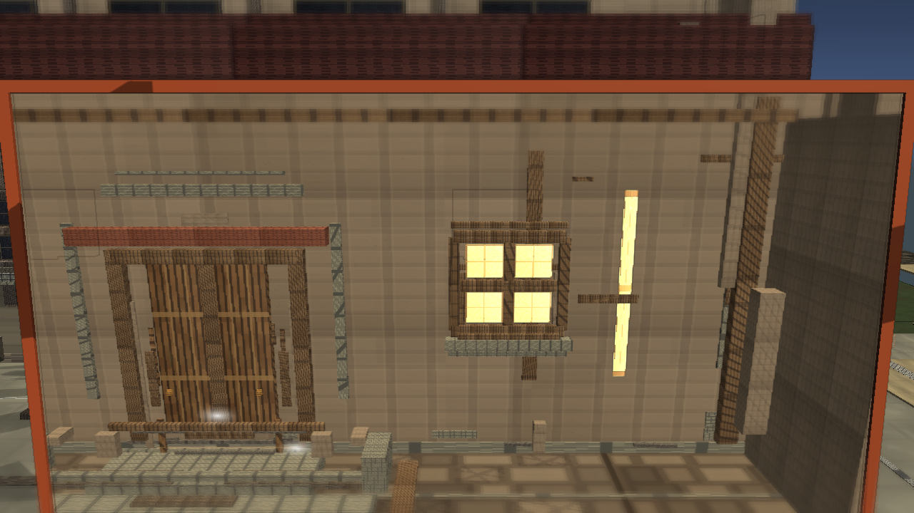

# Stage7z: Public Review Camera Clarity

Branch: `work/fast-vs-hd2d-shading-foundation-20260522`

Stage7z reframes the public Exterior review image so the shot is less dominated by the roof/wall obstruction. This is a viewer-facing review checkpoint, not a final visual judgment.

## Build

`C:\Users\maro6\Documents\Unity\Anemora-fast-vs-v24-hd2d-work\Builds\FastVS_HouseSlice\Anemora_FastVS_HouseSlice.exe`

Launch the whole folder: **フォルダごと起動**

`C:\Users\maro6\Documents\Unity\Anemora-fast-vs-v24-hd2d-work\Builds\FastVS_HouseSlice`

## Capture

Internal capture output:

`C:\Users\maro6\OneDrive\work\projects\anemora_reference\reference\20260527_stage7z_public_review_camera_clarity`

This public review copy intentionally excludes external target reference images, comparison boards, and obstructed route-close diagnostic shots.

## Verification

- `Anemora.EditorTools.AnemoraFastVsHouseSliceSetup.ValidateHd2dStage7PublicReviewCameraClarityBatch`: exit 0.
- `Anemora.EditorTools.AnemoraFastVsHouseSliceSetup.CaptureHd2dStage7PublicReviewCameraClarityReferenceScreenshotsBatch`: exit 0 with graphics enabled.
- `Anemora.EditorTools.AnemoraFastVsHouseSliceSetup.BuildAndValidateBatch`: `Build Finished, Result: Success.`
- Built player smoke: 24-second null-graphics smoke stopped after startup; no exception/shader/C# compile-error matches were found.
- New review PNG alpha: opaque `(255, 255)`.

## Dark-Region Measurement

- `home.png`: dark `<45` `0.147`, central dark `<45` `0.170`.
- `Home_outside.png`: dark `<45` `0.158`, central dark `<45` `0.146`.
- `library.png`: dark `<45` `0.207`, central dark `<45` `0.076`.
- `plaza_01.png`: dark `<45` `0.060`, central dark `<45` `0.077`.
- `plaza_02_niro_in_shadow.png`: dark `<45` `0.080`, central dark `<45` `0.093`.
- `tw_current_aperture.png`: dark `<45` `0.107`, central dark `<45` `0.002`.

## Images

## Current Gap Evaluation

- The Exterior capture is more readable than the previous roof-dominant public shot, but it still lacks strong HD-2D composition, depth layering, and material richness.
- Library and plaza are inspectable in this set, but the overall scene remains far below the target reference quality.

Judgment pending. Work continues until an explicit stop instruction.
