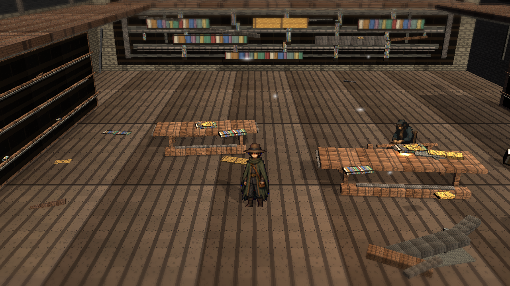
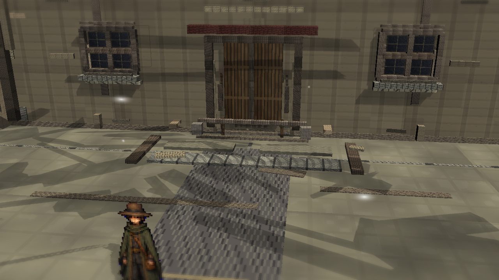

# Stage8c: Library Light Hierarchy

Branch: `work/fast-vs-hd2d-shading-foundation-20260522`

Stage8c adds current-library warm floor pools and cool window washes. This is a viewer-facing review checkpoint, not a final visual judgment.

## Build

`C:\Users\maro6\Documents\Unity\Anemora-fast-vs-v24-hd2d-work\Builds\FastVS_HouseSlice\Anemora_FastVS_HouseSlice.exe`

Launch the whole folder: **フォルダごと起動**

`C:\Users\maro6\Documents\Unity\Anemora-fast-vs-v24-hd2d-work\Builds\FastVS_HouseSlice`

## Capture

Internal capture output:

`C:\Users\maro6\OneDrive\work\projects\anemora_reference\reference\20260527_stage8c_library_light_hierarchy`

This public review copy intentionally excludes external target reference images, comparison boards, and obstructed route-close diagnostic shots.

## Verification

- `Anemora.EditorTools.AnemoraFastVsHouseSliceSetup.ValidateHd2dStage8CLibraryLightHierarchyBatch`: exit 0.
- `Anemora.EditorTools.AnemoraFastVsHouseSliceSetup.CaptureHd2dStage8CLibraryLightHierarchyReferenceScreenshotsBatch`: exit 0 with graphics enabled.
- `Anemora.EditorTools.AnemoraFastVsHouseSliceSetup.BuildAndValidateBatch`: `Build Finished, Result: Success.`
- Built player smoke: 24-second null-graphics smoke stopped after startup; no exception/shader/C# compile-error matches were found.
- New review PNG alpha: opaque `(255, 255)`.

## Dark-Region Measurement

- `home.png`: dark `<45` `0.024`, central dark `<45` `0.023`.
- `Home_outside.png`: dark `<45` `0.073`, central dark `<45` `0.077`.
- `library.png`: dark `<45` `0.158`, central dark `<45` `0.033`.
- `plaza_01.png`: dark `<45` `0.042`, central dark `<45` `0.050`.
- `plaza_02_niro_in_shadow.png`: dark `<45` `0.056`, central dark `<45` `0.059`.
- `tw_current_aperture.png`: dark `<45` `0.037`, central dark `<45` `0.000`.

## Images

## Current Gap Evaluation

- The Library remains inspectable and non-black, but Stage8c's visual delta is small.
- Stronger lighting, shadow, atmosphere, and material richness are still needed; the scene remains substantially below target HD-2D quality.

Judgment pending. Work continues until an explicit stop instruction.
