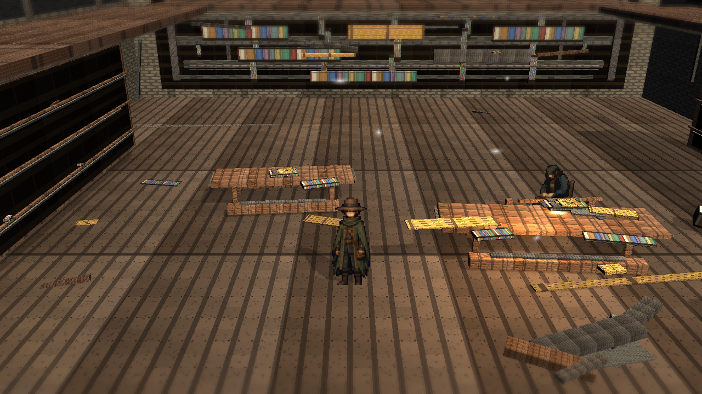

# Stage8h: Library Material Readability

Branch: `work/fast-vs-hd2d-shading-foundation-20260522`

Stage8h adds current-Library material readability accents on tables, floor bands, contact shadows, and rear shelf markers. This review set is curated for public viewer legibility: numbered filenames make the representative thumbnail start from the bright plaza overview, and no external reference images, comparison boards, or obstructed route-close diagnostic shots are included.

## Build

`C:\Users\maro6\Documents\Unity\Anemora-fast-vs-v24-hd2d-work\Builds\FastVS_HouseSlice\Anemora_FastVS_HouseSlice.exe`

フォルダごと起動:

`C:\Users\maro6\Documents\Unity\Anemora-fast-vs-v24-hd2d-work\Builds\FastVS_HouseSlice`

## Capture

Internal capture output:

`C:\Users\maro6\OneDrive\work\projects\anemora_reference\reference\20260527_stage8h_library_material_readability`

Public review directory:

`docs/review/2026-05-27T07-54/`

## Verification

- `Anemora.EditorTools.AnemoraFastVsHouseSliceSetup.ValidateHd2dStage8HLibraryMaterialReadabilityBatch`: exit 0.
- `Anemora.EditorTools.AnemoraFastVsHouseSliceSetup.CaptureHd2dStage8HLibraryMaterialReadabilityReferenceScreenshotsBatch`: exit 0.
- `Anemora.EditorTools.AnemoraFastVsHouseSliceSetup.BuildAndValidateBatch`: `Build Finished, Result: Success.`
- Built player smoke: 24-second null-graphics startup smoke; no exception/shader/C# compile-error patterns were found.
- New review PNG alpha: opaque `(255, 255)`.

## Dark-Region Measurement

- `01_plaza_overview.png`: mean `92.8`, dark `<45` `0.060`, central dark `<45` `0.081`.
- `02_library_material_readability.png`: mean `69.3`, dark `<45` `0.184`, central dark `<45` `0.077`.
- `03_timewindow_aperture.png`: mean `85.9`, dark `<45` `0.107`, central dark `<45` `0.002`.
- `04_home_interior.png`: mean `64.9`, dark `<45` `0.147`, central dark `<45` `0.178`.
- `05_house_exterior.png`: mean `69.7`, dark `<45` `0.158`, central dark `<45` `0.147`.
- `06_plaza_shadow_route.png`: mean `85.5`, dark `<45` `0.080`, central dark `<45` `0.095`.

Compared with Stage8g, `02_library_material_readability.png` measured `mean_abs=0.578` and changed pixel ratio `0.0176`.

## Images

## Current Gap Evaluation

- The review set is inspectable and non-black, with no external reference or comparison images.
- Stage8h improves Library material readability locally, but the visual delta is still small.
- The scene remains substantially below target HD-2D quality.

Judgment pending. Work continues until an explicit stop instruction.
