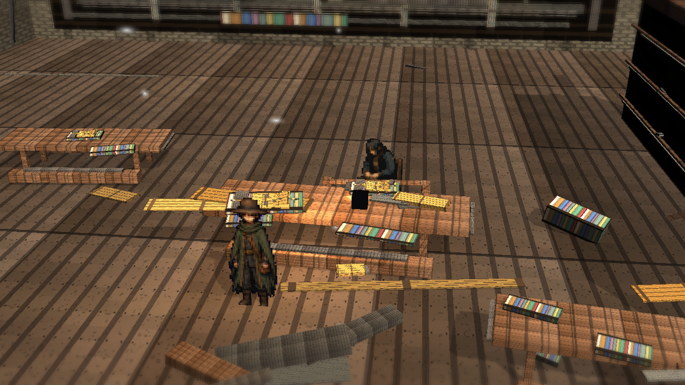

# Stage8j: Library Table Light Depth

Branch: `work/fast-vs-hd2d-shading-foundation-20260522`

Stage8j adds authored current-Library table light/material depth: a warm floor spill, diagonal cool floor break, long-table warm rim/page glow, readable open-book detail, and small ink/contact shadows. The Library review frame keeps the Stage8i composition so the table detail remains visible in the public viewer.

This curated review set uses numbered filenames so the representative thumbnail starts from the bright plaza overview. It does not include external reference images, comparison boards, stage comparison boards, or obstructed diagnostic shots.

## Build

`C:\Users\maro6\Documents\Unity\Anemora-fast-vs-v24-hd2d-work\Builds\FastVS_HouseSlice\Anemora_FastVS_HouseSlice.exe`

フォルダごと起動:

`C:\Users\maro6\Documents\Unity\Anemora-fast-vs-v24-hd2d-work\Builds\FastVS_HouseSlice`

## Capture

Internal capture output:

`C:\Users\maro6\OneDrive\work\projects\anemora_reference\reference\20260527_stage8j_library_table_light_depth`

Public review directory:

`docs/review/2026-05-27T08-55/`

## Verification

- `Anemora.EditorTools.AnemoraFastVsHouseSliceSetup.ValidateHd2dStage8JLibraryTableLightDepthBatch`: exit 0.
- `Anemora.EditorTools.AnemoraFastVsHouseSliceSetup.CaptureHd2dStage8JLibraryTableLightDepthReferenceScreenshotsBatch`: exit 0.
- `Anemora.EditorTools.AnemoraFastVsHouseSliceSetup.BuildAndValidateBatch`: `Build Finished, Result: Success.`
- Built player smoke: 24-second null-graphics startup smoke; exception/shader/C# compile-error pattern scan returned 0 matches.
- New review PNG alpha: opaque `(255,255)`.

## Dark-Region Measurement

- `01_plaza_overview.png`: mean `89.5`, dark `<45` `0.067`, central dark `<45` `0.086`.
- `02_library_table_light_depth.png`: mean `71.5`, dark `<45` `0.148`, central dark `<45` `0.092`.
- `03_timewindow_aperture.png`: mean `82.3`, dark `<45` `0.114`, central dark `<45` `0.005`.
- `04_home_interior.png`: mean `61.8`, dark `<45` `0.190`, central dark `<45` `0.213`.
- `05_house_exterior.png`: mean `66.6`, dark `<45` `0.197`, central dark `<45` `0.156`.
- `06_plaza_shadow_route.png`: mean `82.6`, dark `<45` `0.088`, central dark `<45` `0.106`.

Compared with Stage8i, `02_library_table_light_depth.png` measured `mean_abs=0.642` and changed pixel ratio `0.0379`.

## Images

## Current Gap Evaluation

- The review set is public viewer-facing and excludes external reference/comparison material.
- Stage8j adds authored Library table light/material depth, but it is not a final visual judgment.
- The scene remains substantially below target HD-2D quality.

Judgment pending. Work continues until an explicit stop instruction.
