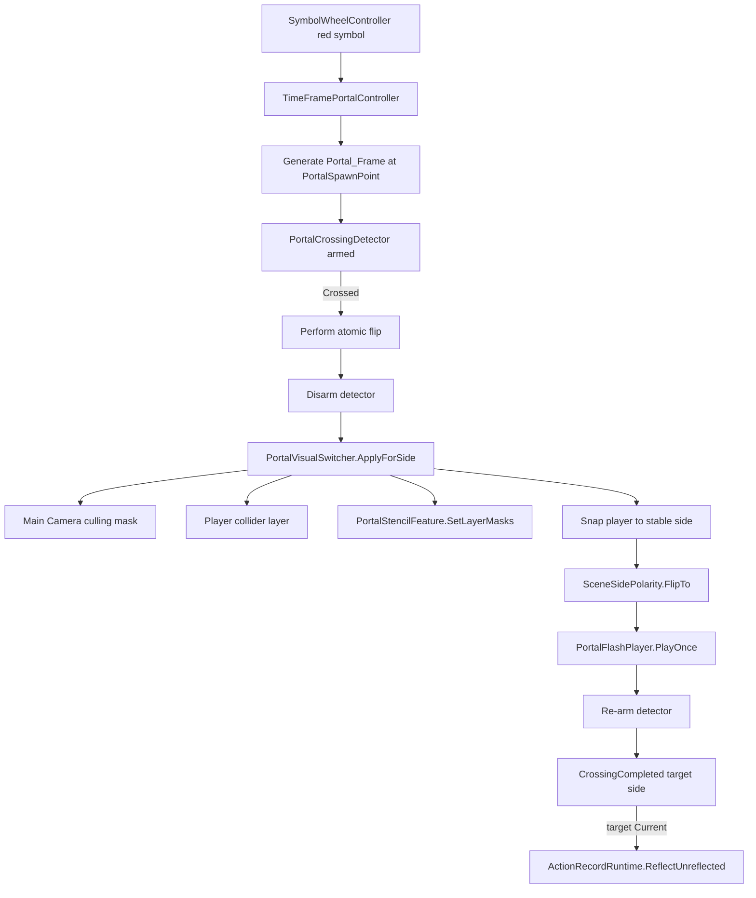

# Anemora_Main Scene Tour

Status: Draft for onboarding

Last scene scan: 2026-05-05

## 1. Scope

This document walks through `Assets/Scenes/Anemora_Main.unity` for new contributors. It is based on a direct scan of the scene YAML, relevant prefab sources, and the runtime component scripts. It does not list objects that were not present in the scene or referenced prefab instances at scan time.

Scan summary:

- Scene root entries: 11.
- Named scene-local GameObject blocks: 17.
- Stripped prefab GameObject blocks: 2.
- Named PrefabInstance roots in the scene YAML: 11.
- Scene-assigned layers: 0, 5, 8, 10, 11.

## 2. Root-Level Hierarchy

Unity `SceneRoots` order:

| Root entry | Layer | Source / main components | Responsibility |
|---|---:|---|---|
| `Main Camera` | 0 | `Camera`, URP additional camera data, `AudioListener` | Primary VS camera. `PortalVisualSwitcher` changes this camera's culling mask when the active side flips. |
| `Directional Light` | 0 | `Light` | Baseline scene lighting for the prototype scene. |
| `Root_Current` | 0 | `Transform` | Parent for Current-side visual geometry and the ActionRecord reflection spawn parent. Children use Layer 10. |
| `Root_Past` | 0 | `Transform` | Parent for Past-side visual geometry, the past book interactable, and Resident NPC prefab instances. Children use Layer 11. |
| `Camera_Past` | 0 | inactive `Camera`, `PastCameraSync` | Disabled Past camera skeleton. It syncs to `Main Camera` and culls Layer 11 when enabled, but the current VS path uses `Main Camera` culling flips instead. |
| `SceneRootRegistry` | 0 | `SceneRootRegistry` | Registry for `Root_Current`, `Root_Past`, `Main Camera`, and `Camera_Past`. `pastRootVisibleOnStart` is true in the scene. |
| `Player` | 8 | tag `Player`, `PrototypePlayerController`, `CapsuleCollider` | Prototype controllable player. It starts on Layer 8 and has Current/Past visual prefab children under it. |
| `PortalSpawnPoint` | 0 | `Transform` | Spawn and plane reference for the time-frame portal. Position is `(0, 0.9, -0.25)` and the scene rotation points the portal normal along back. |
| `SymbolWheel` | 5 | PrefabInstance: `Assets/UI/Prefabs/SymbolWheel.prefab`, `SymbolWheelController` | Root UI for symbol choice. The scene overrides the prefab root and child UI layers to Layer 5. |
| `TimeFramePortalSystem` | 0 | `TimeFramePortalController`, `PortalCrossingDetector`, `SceneSidePolarity`, `PortalVisualSwitcher`, `PortalFlashPlayer`, `Volume`, `ActionRecordRuntime`, `BookReflector` | Central runtime object for portal generation, side flip, visual layer switching, flash, ActionRecord dispatch, and book reflection. |
| `DialogueCanvas` | 5 | `Canvas`, `CanvasScaler`, `GraphicRaycaster`, child PrefabInstance `DialoguePanel` | Dialogue UI root. `DialoguePanel` provides `DialogueDisplay` and TMP text fields. |

`Resident_A_Instance` and `Resident_B_Instance` are not root-level objects; they are PrefabInstances parented under `Root_Past`.

## 3. Current / Past Visual Structure

Current-side branch:

```text
Root_Current [Layer 0]
  Current_Floor [Layer 10]
  Current_BedPlaceholder [Layer 10]
    BookSpawn_Bed [Layer 10]
  ActionRecordReflections_Current [Layer 10]
```

Past-side branch:

```text
Root_Past [Layer 0]
  Past_Floor [Layer 11]
  Past_Table [Layer 11]
  Past_BookPlaceholder [Layer 11]
    Book_Family_Past_Model [PrefabInstance, Layer 11]
  Resident_A_Instance [PrefabInstance, Layer 11]
  Resident_B_Instance [PrefabInstance, Layer 11]
```

Player visual branch:

```text
Player [Layer 8, tag Player]
  Player_Visual_Current [Hero.prefab, Layer 10] x3
  Player_Visual_Past [Hero.prefab, Layer 11] x3
```

The three Current visual instances and three Past visual instances are what the scene YAML currently contains. This document records the scan result as-is and does not deduplicate them.

## 4. Layer Assignment

Requested layer scan:

| Layer | Role in current scripts | Scene objects / prefab instances assigned |
|---:|---|---|
| 8 | Current collider layer. `Player` starts here. | `Player` |
| 10 | Current visual layer. `PortalVisualSwitcher` uses mask `1024` for Current visuals. | `Current_Floor`, `Current_BedPlaceholder`, `BookSpawn_Bed`, `ActionRecordReflections_Current`, `Player_Visual_Current` x3. `BookReflector` also references `Book_Family_Current.prefab`, whose prefab root is Layer 10, for runtime spawning. |
| 11 | Past visual layer. `PortalVisualSwitcher` uses mask `2048` for Past visuals. | `Past_Floor`, `Past_Table`, `Past_BookPlaceholder`, `Book_Family_Past_Model`, `Resident_A_Instance`, `Resident_B_Instance`, `Player_Visual_Past` x3 |

Additional layer context:

- Layer 5 is UI: `SymbolWheel`, `DialogueCanvas`, and `DialoguePanel`.
- Layer 9 is configured in `PortalVisualSwitcher` as the Past collider layer, but no scanned scene object starts on Layer 9. The player can be moved to that layer at runtime during Past-side application.

## 5. Portal Runtime Wiring

Scene references on `TimeFramePortalSystem`:

- `TimeFramePortalController.symbolWheel` -> `SymbolWheelController` on `SymbolWheel`.
- `TimeFramePortalController.player` -> `Player`.
- `TimeFramePortalController.portalPrefab` -> `Assets/Prefabs/Portal/Portal_Frame.prefab`.
- `TimeFramePortalController.portalSpawnPoint` -> `PortalSpawnPoint`.
- `TimeFramePortalController.crossingDetector` -> local `PortalCrossingDetector`.
- `TimeFramePortalController.sidePolarity` -> local `SceneSidePolarity`.
- `TimeFramePortalController.visualSwitcher` -> local `PortalVisualSwitcher`.
- `TimeFramePortalController.flashPlayer` -> local `PortalFlashPlayer`.

Confirmed timing / threshold values in the scene:

| Field | Value |
|---|---:|
| `generationDuration` | `0.05` |
| `flipCooldown` | `0.1` |
| `flashDuration` | `0.05` |
| `PortalCrossingDetector.hysteresisBand` | `0.02` |
| `PortalCrossingDetector.minNormalMovement` | `0.05` |

Runtime flow:



Atomic flip ordering in the scene implementation matches the ADR-0005 v1.1 shape: detector disarm, visual/camera/layer/stencil application, player snap, side event, flash, and detector re-arm.

## 6. Action Wiring

### 6.1 NPC Dialogue

Scene-added components:

| Object | Component | Asset reference | Notes |
|---|---|---|---|
| `Resident_A_Instance` | `NpcInteractable` | `Assets/ScriptableObjects/Dialogues/Resident_A_Greeting.asset` | Parent is `Root_Past`; layer override is 11; `interactionRange` uses the script default `1.5`. |
| `Resident_B_Instance` | `NpcInteractable` | `Assets/ScriptableObjects/Dialogues/Resident_B_Idle.asset` | Parent is `Root_Past`; layer override is 11; `interactionRange` is serialized as `1.5`. |
| `DialoguePanel` | `DialogueDisplay` | child of `DialogueCanvas` | `NpcInteractable.TryInteract()` resolves `DialogueDisplay.Instance` and calls `Show(dialogueAsset)` when the player is in range. |

`NpcInteractable` resolves the player by `GameObject.FindWithTag("Player")` and uses `E` as the interact key.

### 6.2 Book ActionRecord

Past-side capture:

- `Past_BookPlaceholder` has `PastBookInteractable`.
- Serialized `actionId`: `take_book_001`.
- Serialized `targetObjectId`: `Book_Family_Past_001`.
- Serialized `interactionRange`: `1.25`.
- Input keys: `E` or `Space`.
- On success, it calls `ActionRecordRuntime.Instance.AddEntry(...)` and deactivates the past book object.

Current-side reflection:

- `ActionRecordRuntime.catalog` -> `Assets/ScriptableObjects/ActionRecords/ActionRecordCatalog.asset`.
- `ActionRecordRuntime.portalController` -> local `TimeFramePortalController`.
- `ActionRecordRuntime.reflectorBehaviours[0]` -> local `BookReflector`.
- `BookReflector.catalog` -> same ActionRecord catalog asset.
- `BookReflector.spawnBookSideEffect` -> `SpawnBookOnBed`.
- `BookReflector.bookPrefab` -> `Assets/Prefabs/Zone1/Book_Family_Current.prefab`.
- `BookReflector.bedSpawnPoint` -> `BookSpawn_Bed`.
- `BookReflector.spawnParent` -> `ActionRecordReflections_Current`.

When `TimeFramePortalController.CrossingCompleted` reports `SceneSide.Current`, `ActionRecordRuntime` calls `ReflectUnreflected()`. `BookReflector.TryReflect(...)` spawns `Book_Family_Current.prefab` at `BookSpawn_Bed` under `ActionRecordReflections_Current`, then `ActionRecordRuntime` marks the entry as reflected.

## 7. Reference Files

- Scene: `Assets/Scenes/Anemora_Main.unity`
- A2 wiring devlog: `docs/devlog/2026-05-05_a2_anemora_main_wiring.md`
- Portal scripts: `Assets/Scripts/TimeManagement/TimeFramePortalController.cs`, `PortalCrossingDetector.cs`, `PortalVisualSwitcher.cs`, `SceneSidePolarity.cs`
- ActionRecord scripts: `Assets/Scripts/TimeManagement/ActionRecordRuntime.cs`, `Assets/Scripts/TimeManagement/Reflectors/PastBookInteractable.cs`, `BookReflector.cs`
- Dialogue scripts: `Assets/Scripts/Dialogue/NpcInteractable.cs`, `DialogueDisplay.cs`

## 8. Caveats

- This pass did not open the Unity Editor; it inspected scene YAML, prefab YAML, and script source.
- Prefab contents can add child objects beyond what the scene YAML stores directly. This tour records scene-local objects and named PrefabInstance roots/overrides visible from the scan.
- `Camera_Past` exists as an inactive skeleton. VS runtime switching is currently driven by `Main Camera` culling masks through `PortalVisualSwitcher`.
