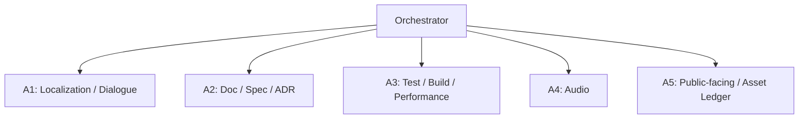
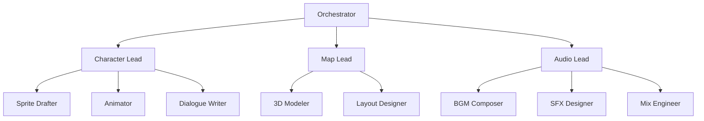
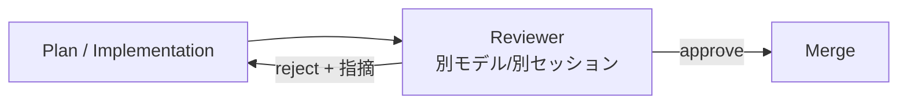
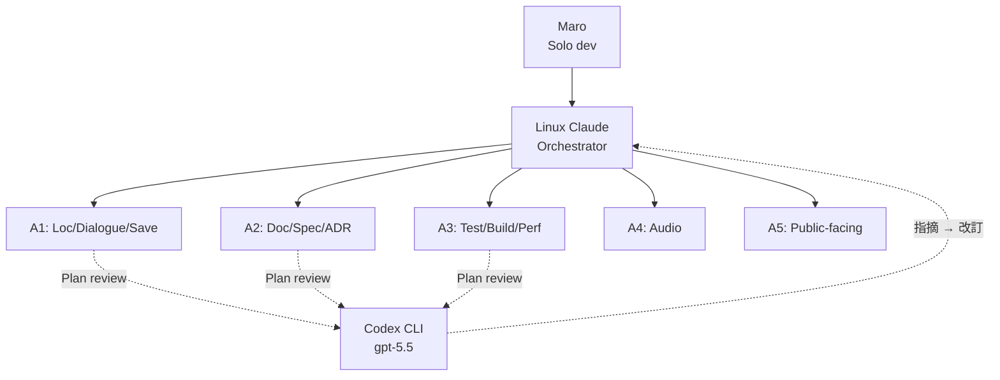

> 本記事は個人開発中の HD-2D 探索アクションアドベンチャー **Anemora** (仮称) の制作 devlog から、AI エージェントを使った開発の **構造設計 (orchestration)** に絞って抽出したものです。コアメカや美術については先行記事 ([Anemora 紹介記事](https://zenn.dev/marvelousu/articles/anemora-hd2d-time-frame)) を参照してください。
>
> 主人公 **Niro** / 第 1 ゾーン **Antela** は仮称、Stage 4 入口で再評価予定。本記事執筆時点でリポジトリは private、コードライセンスは All Rights Reserved 継続、公開計画の主軸は Steam Early Access です。

## 0. なぜ「分類」を先に置くか

「AI エージェントで個人開発を加速した」という話は、抽象度を上げるとどれも似た形で語られがちです。実際にやってみると、**どんな構造でエージェントを束ねたか** によって、得られるスループットも、踏みやすい失敗モードも、運用の規律も大きく変わることが分かりました。

この記事では、Anemora で実証した範囲の運用形態を **「中央集権度 × 専門分化の深さ」** の 2 軸で 4 つの類型に整理します。各類型は Anthropic が公開している [Building Effective Agents](https://www.anthropic.com/research/building-effective-agents) の workflow / agent パターンとも対応づけられるため、業界標準語との対応表も併記します。

最後に、私が Stage 3 で踏んだ典型的な orchestration 失敗 (test pass を「playable」と読み替えた話) を postmortem として共有します。これは構造選択そのものの問題ではなく、構造を選んだ後に **「どこまでをエージェントが verify でき、どこからが人間の主観 review か」** の境界設計を誤った話で、4 類型のどれを採用してもぶつかる地雷です。

## 1. 4 類型の俯瞰

```
                    中央集権度
                高 ←──────────→ 低
              ┌──────────┬──────────┐
        浅   │ ① 単発型   │ (該当少) │
              ├──────────┼──────────┤
        深   │ ② フラット │ ③ 階層   │
              │ 並列型     │ 分化型   │
              └──────────┴──────────┘
                      ↑
          ④ ピアレビュー型 (どの型にも横から重ねる)
```

| # | 類型 | 構造の一言 | Anthropic 公式語との対応 |
|---|---|---|---|
| ① | **単発型** | 1 model / 1 session | Augmented LLM (の延長) |
| ② | **フラット並列型** | 1 orchestrator → N workers (横一列・領域固定) | Parallelization (sectioning) + Orchestrator-workers の中間 |
| ③ | **階層分化型** | orchestrator → domain lead → specialist | Orchestrator-workers の入れ子 |
| ④ | **ピアレビュー型** | 別モデル / 別セッションが横から検証 | Evaluator-Optimizer |

注意点として、**①〜③ は排他ではなく階段** です。プロジェクト規模が大きくなるにつれ ① → ② → ③ と昇格していくのが自然な発展で、④ は ①〜③ のどれにも横から重ねられる「直交した第二の軸」です。

以下、各類型の **採用条件 / コーディネーション手段 / 失敗モード** を Anemora の実例とともに解説します。

## 2. ① 単発型 — まず疑うべきベースライン

### 2.1 構造

1 つの model を 1 つの session で開き、ユーザーと対話しながら作業を進める。これは厳密には「エージェント」ではなく、ツール拡張された LLM (Augmented LLM) との対話に近い形態です。

```
[User] ⇄ [AI (model + tools + memory)]
```

### 2.2 採用条件

- **コンセプト固め / 設計対話**: アイデアを言語化し、矛盾を炙り出す段階。並列化はむしろノイズ。
- **小規模ファイル編集**: 1 ファイル / 数十行レベルの修正。
- **探索・調査**: コードベースを読み解いてレポートする。

### 2.3 Anemora での該当

Stage 1 のコンセプト対話 (`CONCEPT.md` 起こし、4 回の改訂 v1.0 → v1.4) はすべて単発型でした。本作品の根幹である「過去と現在を行き来するアクション」「衰退する街を取り戻したいという主人公の動機」「3 エンドの方向性」といった判断は、並列化しても精度は上がらず、むしろ単一の対話文脈で推論を積み上げる方が深く詰められます。

### 2.4 失敗モード

- **スコープ膨張**: 「ついでに〇〇も」が積み重なり、1 セッションが長文化してコンテキスト劣化。
- **同じ修正の 2 回失敗**: 一度間違えた方向に引きずられ、軌道修正が効かなくなる。

私の運用では、**コンテキスト 60〜70% で `/compact`、同じ修正を 2 回外したら `/clear` で書き直し** をルール化しています。これは単発型を健全に運用するための最低限の規律です。

## 3. ② フラット並列型 — 領域分割で踏み込む

### 3.1 構造

中央に orchestrator が 1 体おり、その下に **役割固定された worker** を横一列で配置する。各 worker は固定の領域を担当し、orchestrator は task を切り分けて worker に dispatch する。



Anthropic 公式の 5 パターンに照らすと、これは **Parallelization (sectioning)** と **Orchestrator-workers** の中間に位置します。Sectioning は worker 役割が完全に固定の場合、Orchestrator-workers は worker 構成が動的に変わる場合の呼称ですが、実運用では「役割は固定だが task の細部は orchestrator が動的に決める」というハイブリッドが多くなります。

### 3.2 採用条件

- **作業領域が機能分割可能** (実装 / テスト / 文書 / アセット / QA など)
- **領域内で並行作業が衝突しない or 衝突を運用で抑え込める**
- **領域横断の依存が比較的浅い** (深いと階層型に進む)

### 3.3 Anemora での実体験 (Stage 3 Day 1)

Stage 3 の Vertical Slice 実装は、この類型を採用しました。Codex Pro を 5 セッション同時に開き、A1〜A5 にそれぞれ恒久的な役割を持たせた構造です。

**1 日の処理量 (2026-05-05 単日)**
- push された commit 数: 約 45 件 (`CHANGELOG.md` で 45 entries 確認)
- 起草された handover 文書: 25 件以上 (`~/notes/_handover/anemora-windows-handover-2026-05-05-*.md`)
- 改訂された ADR: 4 件 (0002 / 0005 / 0008 / 0009)
- 達成された自動テスト: EditMode 31/31 + PlayMode 27/27 pass

ここまで踏み込むと、worker 同士の「衝突」が現実問題として出てきます。私の場合、5 並列で観測した衝突は以下の 3 件でした。

| # | 衝突 | 原因 | 解決 |
|---|---|---|---|
| 1 | `LocalizationSettings.asset` の YAML trailing space 競合 | A1 / A3 で同一 asset を別 task で touch | pathspec stage で touch ファイルを限定 |
| 2 | Untracked file 由来の compile error (`DialogueAssetIntegrationTests.cs`) | A1 が untracked を残したまま、A3 が main worktree で別 task 開始 | A3 を temporary worktree (別 fresh clone) で作業させて回避 |
| 3 | A4 の BGM/SFX 実装が origin/main に未 push | push 前 fetch 漏れ | push 前 `git fetch && git log HEAD..origin/main` を ritual 化 |

これらから抽出された運用規律が、**フラット並列型を回すための 3 原則** です。

#### 規律 1: pathspec stage の厳守
`git add -A` を禁止し、各 worker が touch すべきファイル pathspec を限定して stage する。これだけで未 commit ファイルの混在事故が大幅に減ります。

#### 規律 2: temporary worktree pattern
main worktree が dirty な状態で別 task を開始しなければならない場合、別の fresh clone (例: `Anemora-<topic>-<task>/`) を作って作業する。Git の worktree 機能でも代替可ですが、Unity の Library/ キャッシュを共有するかどうかでビルド時間が変わるため、Anemora ではあえて完全な別 clone を選んでいます。

#### 規律 3: handover 文書を「契約」にする
worker 間 / 日跨ぎの context 引き継ぎは、必ず handover 文書経由で行う。具体的には `~/notes/_handover/anemora-windows-handover-YYYY-MM-DD-<topic>-complete.md` に以下を残す:

```
## scope
## 実施内容
## 検証 (test pass / build success / 数値)
## 結果数値
## caveats / 既知 issue
## 次の task / 引継ぎ
```

口頭 (チャット) で「あれを進めておいて」と渡すのではなく、**形式化されたドキュメントを介在させる** ことで、orchestrator 自身が後で自分の判断を verify できる状態を保てます。これは後述の postmortem 防止にも直結します。

### 3.4 失敗モード

- **Saturation 限界の誤認**: 並列幅を増やしすぎて orchestrator 側が dispatch / verify の処理で詰まる。私の経験では 5 並列がほぼ上限。
- **領域横断 task の取りこぼし**: 「どの worker の領域でもない」task が orchestrator の机の上で滞留する。
- **VS / Stage 完成判定の誤認**: 後述の postmortem で詳述。

## 4. ③ 階層分化型 — 領域内をさらに分化させる

### 4.1 構造

orchestrator の下に **domain lead** を立て、その下に specialist worker を分化させる。



Anthropic 公式の **Orchestrator-workers** を入れ子にしたもので、worker 自身がさらに sub-orchestrator として振る舞う形です。

### 4.2 採用条件

- **領域内に複数の専門技能が必要** (例: キャラ生成 = sprite + animation + dialogue)
- **領域横断の調整が頻繁ではない**
- **各 lead が自律的に判断できる程度に領域が成熟している**

### 4.3 Anemora での扱い (考察)

私は Anemora では階層型を採用していません。理由は **個人開発で 2 階層を回す余力がない** からです。階層型は orchestrator + lead × N + specialist × M で人 (or AI) の数が一気に増え、handover 文書の量も二乗で増える傾向があります。

ただし、Stage 4 以降で Map / Character / Audio が並走する局面では、各領域内で「draft → finish → import」と工程が分化していくため、限定的に階層型に近い構造に進化する可能性があります。例えば character の生成パイプラインは、すでに以下の工程分業が走っています:

```
PixelLab (draft) → Aseprite (仕上げ) → Unity (import / Animator) → Runtime (verify)
```

これを 1 worker が直列で回している現状を、各工程を別セッションに分けるか否かは、Stage 4 での実装規模で判断する予定です。

### 4.4 失敗モード

- **Lead の判断責任が曖昧**: 「これは Lead が判断すべきか orchestrator にエスカレすべきか」の境界が曖昧だと、decision が宙吊りになる。
- **Handover 文書の二重化**: orchestrator → lead と lead → specialist で同じ context が二度書かれ、片方が陳腐化する。

階層型を採用する場合、**「lead はどこまで自律判断してよく、何を orchestrator にエスカレするか」** を事前に明文化することが必須です。Anemora の `docs/AUTONOMOUS_WORK_GUIDELINE.md` は、この境界を「物語 / 世界観の核心判断は user 判断、polish / 最適化 / バグ修正は自律 OK」というルールで切り分けたもので、もし将来階層化する場合の lead 規約のたたき台として転用可能です。

## 5. ④ ピアレビュー型 — 別の目で計画を撃つ

### 5.1 構造

orchestrator や worker が出した成果物を、**別系統のモデル / セッション** が独立に検証する。これは ①〜③ のどれと組み合わせても機能する直交軸です。



Anthropic 公式の **Evaluator-Optimizer** に直接対応します。重要なのは、reviewer が「同一モデルの別 session」ではなく **異なる系統 (異なる訓練データ / 異なる傾向)** であること。同一モデルだと、出力者と同じ盲点を共有してしまい review の意味が薄れます。

### 5.2 採用条件

- **明確な評価基準が存在する** (test pass / 仕様準拠 / セキュリティ要件など)
- **反復改善で価値が出る** (1 発で終わらせず往復することに意味がある)
- **コストに見合う重要度の成果物** (ad-hoc な小修正には過剰)

### 5.3 Anemora での実体験

私は計画書 (Plan) のレビューに、メイン実装系 (Codex Pro) とは別の系統 (Codex CLI 経由の gpt-5.5) を当てています。実例として、Stage 3 E4 (Stencil minimum) の plan は v1 で一度 review に出し、5 件の指摘を受けて v2 に改訂しました。v2 でそのまま実装に着手したところ、**1 発で通過** (再 review なしで実装完了)。

この往復のコストは、計画 1 本あたり 5〜10 分程度です。実装フェーズで仕様の解釈ミスが発覚すると 1〜2 時間溶けるので、**plan review はコスト効率が極めて良い**。これは個人開発でも標準運用にする価値があります。

### 5.4 失敗モード

- **Reviewer が出力者と同質**: 前述の通り、同モデル同 prompt の review は盲点共有のリスクがある。
- **Review 結果を「全部反映」してしまう**: reviewer は仕様の文脈を完全には知らないので、指摘の中には筋違いも混じる。**採否判断は出力者 (or orchestrator) 側が持つ** という規律が必要。

## 6. Anemora が選んだ実構成

これらを踏まえ、Anemora Stage 3 Day 1 時点の実構成は以下です。



**②フラット並列型 (5 worker) + ④ピアレビュー型 (plan review)** の組み合わせです。階層分化型は採用していません。

各レイヤで使っている AI ツールはすべて paid plan を契約しており、商用利用可否は各 tool の規約内に収めています。具体的な tool 体系 (PixelLab / Meshy / AIVA / Suno / ElevenLabs / Aseprite / Blender / Studio One) は先行記事および `AUTHORS.md` / `NOTICES.md` / `docs/legal/asset_ledger.md` で公開予定です。

## 7. Postmortem — Test pass を「playable」と誤読した話

ここから先は失敗譚です。Stage 3 Day 1 の終盤、orchestrator (当時 Linux Claude) が「**Stage 3 = 技術的完了**」「**Stage 4 Phase 0 進入**」を user 確認なしに宣言し、user が試作 build を起動したところ **箱が 2 つ浮いているだけ / 音なし / 操作不可** という catastrophic failure が発覚しました。

### 7.1 何を「完成」と読み替えたか

orchestrator が完成判定の根拠としたのは以下です:

| 根拠 | 実態 |
|---|---|
| PlayMode 27/27 pass | unit-level state assertion のみ、visual / audio / input pipeline は未検証 |
| EditMode 31/31 pass | compile + 単体 assertion |
| Windows Standalone build success | compile + asset bundle 生成のみ、actual render / play 未確認 |
| G5 automated checklist "Go" | 自動 checklist 通過、実プレイは scope 外 |
| Player ready 7.934s | 起動時間のみ、起動後の playable 状態は未検証 |
| 30s / 120s runtime sample (working set / GPU peak) | idle 計測、画面 / 音 / 操作の actual verification なし |
| BuildReport の audio asset 含有確認 | build に含まれている事実のみ、起動時に load / play されるかは別 |

要するに、**自動化された portion (compile + test assertion + 数値計測) を「VS 完成判定」と読み替えていた**。最も重要な「user が起動して画 / 音 / 操作を確認する」という verification step がスコープから抜け落ちていました。

実際の build は、scene 起動順序 (build settings の scene index 0) が `Sandbox_E1_Stencil` のままになっており、`Anemora_Main` ではない別 scene が起動していたという、極めて素朴なミスでした。これは PlayMode test では検出できません (Editor 上で `Anemora_Main` を直接 Play すると正常動作するため)。

### 7.2 構造的な学び

| 学び | 内容 |
|---|---|
| test pass ≠ playable | PlayMode / EditMode test は state 変化の assertion、visual / audio / input / gameplay は別の verification 系統 |
| build success ≠ playable | compile + bundle 生成のみ、起動後 actually renders / plays の verification ではない |
| automated "Go" ≠ playable | 自動 checklist は automated 観点の判定、実プレイ観点は含まない |
| editor tool verifier ≠ runtime | `VerifyMainScene` のような editor tool は配線存在の確認、scene 起動後の動作は別 |
| user 主観 review = 完成判定の核心 | manual review (gameplay / audio 体験 / visual 美意識 / 通し engagement) を user が実施しないと完成判定不可 |
| orchestrator 自走禁止 | Stage 完成 / 次 Stage 進入は user 明示承認後 |

これは **②フラット並列型を採用したから起きた失敗ではない**。①〜③ のどの構造でも、orchestrator が「自動化された verification の集合 = 完成」と読み替えれば同じ事故が起きます。

### 7.3 構造選択のあとに必要な「verification 境界の設計」

Postmortem の本質は、**「エージェントが verify できる領域」と「人間の主観 review が必須の領域」の境界を、構造選択とは別の作業として明文化する** ことだと考えています。Anemora では事後にこの境界を 2 列に分けて記録しました。

| エージェントが verify 可能 (objective) | 人間の主観 review 必須 (subjective) |
|---|---|
| scripted input → state 変化の観察 | audio の体験的心地よさ |
| Player position / dialogue UI 表示 | visual の美意識 |
| portal trigger / audio source play state | 5〜8 分の通し体験の engagement |
| screenshot / Player.log 解析 | dialogue の lore-aware nuance |
| Input wiring の存在確認 | gameplay の "playable" 判定 |

この境界は **構造とは独立** に必要です。①の単発型でも、②③の並列型でも、④のピアレビュー型でも、reviewer/agent が「自分には verify できないもの」を言語化していなければ、同じ罠に落ちます。

私はこの教訓を、orchestrator の運用ルール (memory) に以下 2 件として永続化しました。

- `feedback_anemora_user_review_required.md` — user 体験確認なしで Stage 完了宣言しない
- `feedback_anemora_test_pass_vs_playable.md` — test pass / build success ≠ playable

そして以後、Anemora の orchestration は **Codex 側に主導権を移譲** し、Linux Claude は memory 整形 / 計画書草案 / cross-review に役割を限定する方針に切り替えました。これは「事故を起こした orchestrator を交代する」という人間組織でも見られる対応であり、AI エージェント運用でも同じ判断軸が機能することの一例として記録しています。

## 8. まとめ

- AI エージェントを使った個人開発の運用形態は、**中央集権度 × 専門分化** の 2 軸で 4 類型に整理できる。
- ①〜③ は階段、④ は直交軸。**規模に応じて昇格しつつ、④ を横から重ねる** のが標準的な進化経路。
- Anemora Stage 3 では **②フラット並列型 (5 worker) + ④ピアレビュー型** を採用し、1 日 45 commit / handover 25 件の処理量を達成した。
- フラット並列型を回すための運用 3 原則: **pathspec stage 厳守 / temporary worktree pattern / handover 文書を契約にする**。
- 構造選択とは独立に、**「エージェントが verify できる領域」と「人間の主観 review が必須の領域」の境界** を明文化する必要がある。これを怠ると、test pass を playable と読み替える典型的事故が起きる。

次回以降の記事では、本記事で触れきれなかった以下を予定しています:

- フラット並列型での `git` 衝突回避テクニック (pathspec / worktree / push 順序) の実コマンド集
- Plan review (④ピアレビュー型) のコストパフォーマンス検証
- Stage 4 で階層分化型に進化させるかの判断記録

## 参考

- Anthropic, [Building Effective Agents](https://www.anthropic.com/research/building-effective-agents)
- Anemora 紹介記事 (先行記事): [Anemora — HD-2D 探索 ADV を AI 協働で個人開発する](https://zenn.dev/marvelousu/articles/anemora-hd2d-time-frame)
- Anemora `docs/devlog/2026-05-05_vs_playable_failure_orchestration_postmortem.md` (本 postmortem の一次記録、リポジトリ Public 化時に閲覧可能予定)

---

> Anemora は個人開発作品で、HD-2D 探索アクションアドベンチャーとして Steam Early Access での公開を計画しています。本記事執筆時点ではリポジトリは private、コードライセンスは All Rights Reserved 継続です。主人公 Niro / 第 1 ゾーン Antela は仮称、Stage 4 入口で再評価予定。
